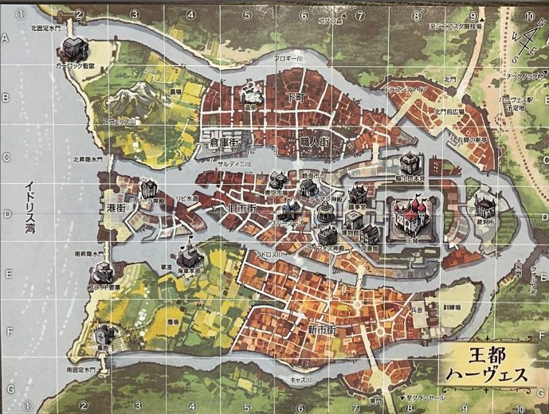
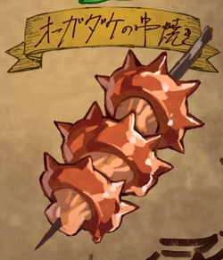
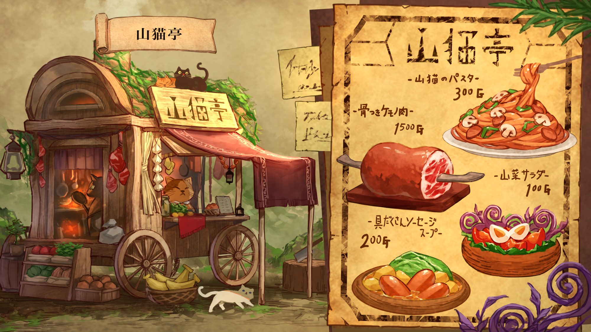
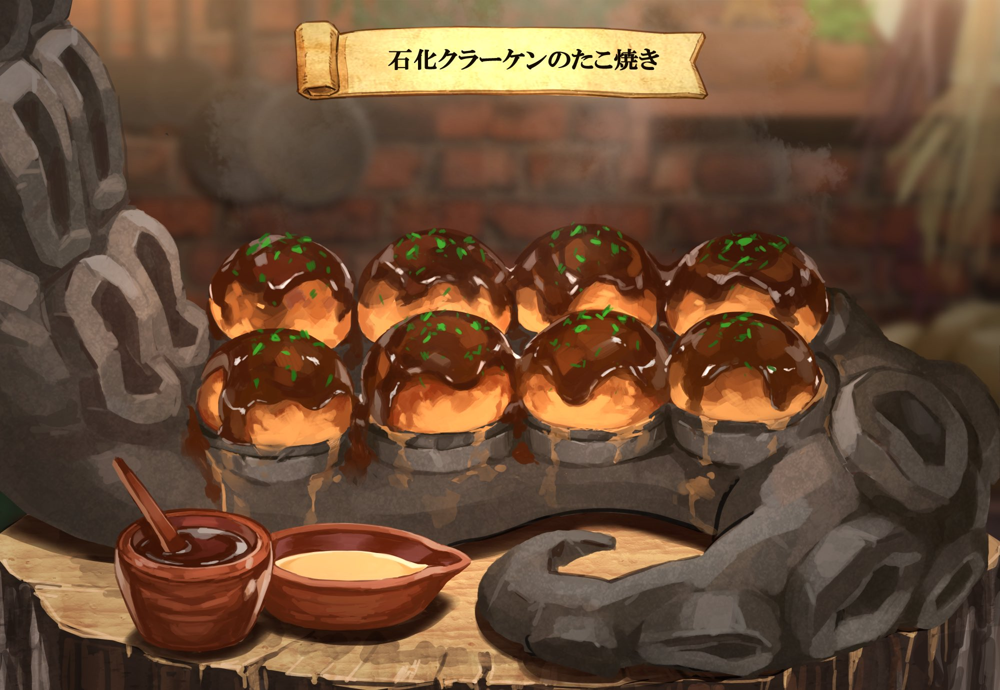
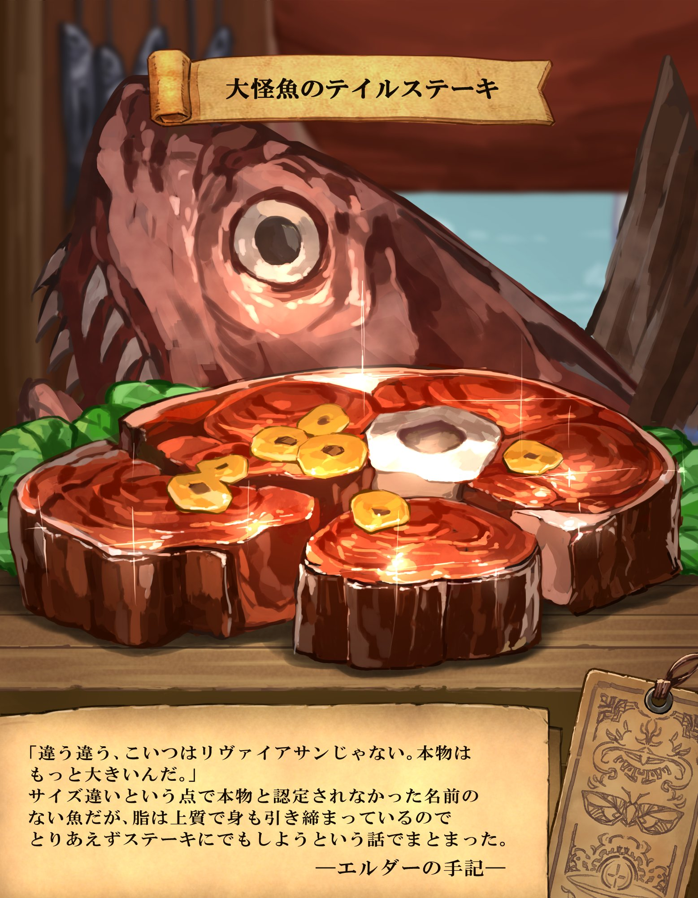

卓の基本情報は[こちら](./info.md)

---
---

# 第1話 『Menu：スチームポッド』

## ◉ 前提知識として

【大食堂列車フランベ】

> 今現在ではアルフレイム大陸を走る、魔導鉄道です。 
> 鉄道ではありますが、決まった線路を持たず行先に線路を作り、通った後には線路を回収して進んでいきます。 
> この列車は様々な町を巡り、様々な土地を駆けていきますが、その目的地は『美味い物があるところ』であり、新たなる食材、美味しい料理を目指しています。 
> オーナーである“車長”の方針から、人族も蛮族も区別なく乗客・乗員として扱われ、問題を起こせば区別も容赦もなく『食材』として扱われてしまうので注意が必要です。 
> 主な乗員は蛮族ではコボルド、人族ではエルフなど器用な種族が多く、それに次いでウィークリングやナイトメア、アルヴなどの差別を受けやすい種族が多いのが特徴になっています。 
> 列車の構成は、線路の敷設と運転を行う先頭車両、車長の居室である２号車、車長の食事専用の厨房である３号車、食料庫である４号車、各乗員の居室となる車両である５～３０号車、乗客・乗員用の厨房である３１号車、特別な乗客用の食堂である32号車、一般の乗客用の食堂である３３～３５号車、客室である３６～５０号車の、計５０車両となっています。 
> 各客室は豪華であり、それぞれが高級ホテルの一室の様に作られています。 
> 列車自体は魔動機文明の時代にできた物で、大破局の際に破壊されかけた先頭車輌を車長が確保して、徐々に車両を増設しながら現在まで運用しているそうです。 
> この列車の向かう先には、先触れと斥候、露払いを兼任してフライングカルキノスが先行することが基本であり、町や村はこのフライングカルキノスの登場で車長が来ることを知ります。 
> 向かう先の町に冒険者ギルドがあれば、食料調達のための依頼を出す事もあり、その依頼の数は膨大になるため一時的な特需が発生することもあります。 
> また、冒険者たちが依頼の食材を持って来た場合は、その一部を使い報酬の一環として料理を振る舞ってくれる事もあるそうです。 
> 人族も蛮族も区別なく乗るこの列車は、世界でも数少ない双方にとっての安全圏であり、交流圏となっています。

## ◉ 導入

- ドーデン地方
  - マグノア草原国から始まる
- 冒険者ギルド「野風の灯火（のかぜのともしび）」に所属
  - 1 ～ 2 回くらい一緒に冒険
- なにか盛り上がっている
  - いつもより依頼の量が多い

- 奥の方に固まっている「余り物」がいる
  - PTメンバーとなるキャラクターたちだ

### ▼ 依頼内容

- スチームポッドの種の納品依頼
  - 量
    - 多ければ多いほど報酬を支払う
  - 報酬
    - 最低でも500ガメル (1 人につき)
  - 場所
    - 取ってくればどこでもいい (つまり自分で調べるか聞きこめってこと)
  - 期限
    - 列車到達から 1 日後まで

### ▼ 街を出る

- イオとセルフィアが、野ウサギと香草を手に入れる
  - イオがいい感じの食事を作る
    - 普通の味だ
  - 食器が足りないから、持っている人間だけ
    - それ以外は鍋から直接つつく

## ◉ 探索

- 独自の探索度という進行度を使う
- 進行度は足し算

### ▼ 2D ⇒ 8

特になにもない

### ▼ 2D ⇒ 6 (計 14)

特になにもない

### ▼ 2D ⇒ 9 (計 23)

- 1D ⇒ 4
  - 聖職者が向かいから歩いてくる
  - 聖職者にスチームポットの位置を聞く
    - 山の麓付近に群生地があるとのこと
    - 荒れてるから気をつけるように言われる

### ▼ 2D ⇒ 7 (計 30)

特になにもない

### ▼ 2D ⇒ 5 (計 35)

- 1D ⇒ 2
  - 山の麓に来たが、険しい道のりだ
    - 先がカーブで何があるかわからない
    - フィル、ルーナ：危機感知 ⇒ 失敗
    - アル：危機感知 ⇒ 成功
  - 落石だ！間一髪避けることができた

## ◉ 古びた発掘現場跡地

- 古びた発掘現場跡地に到着する
- アルが探索
  - [魔]〈スマルティエの疾風の腕輪〉が見つかる
  - アルがそのまま装着する
- そろそろ夜だ
  - 夜営をするので、その準備をする
    - セルフィア、アル、イオ
      - 外部へ食料探索
        - イオが食料を発見
          - シカと、群れから離れた手負いのウルフを狩猟
          - ウルフは群れるのに、手負いで群れから離れているのを不自然に感じる
        - セルフィアとアルは特に何も発見せず
    - ロボジャック、フィル
      - 跡地内部探索
        - ロボジャックは壊れた魔導器を見つける（特になにもない）
        - フィルが〈魔力を帯びた骨〉〈魔晶石・1点〉を発見
        - 2人で火種になりそうなものも発見
    - オズ、ルーナ
      - 夜営用の設営
        - 設営はまずまずいい感じにできた
        - オズが余った時間で簡易机を作成する

## ◉ 夜営

- イオが料理を作る
  - 美味しい！
- イオが「ウルフが手負いで、かつ群れから離れている」ことを共有する
- アル・フィルが鳴子をつくる
- 睡眠が不要であるメリアの二人が夜を徹して周辺の警戒をしてくれる
  - 他のメンバーは寝る
  - メリアの 2 人は夜営中に会話を少ししたみたいだが、全然会話が盛り上がらずにすぐに終わったようだ
- いい感じに休憩ができた！
- イオ、セルフィア：探索 ⇒ 失敗
  - 特になにもなかった

## ◉ 翌朝

- イオが料理をつくった！
  - 微妙な味だった
    - 残り物だし仕方ないね

### ▼ 2D ⇒ 8 (計 43)

特になにもない

### ▼ 2D ⇒ 3 (計 46)

- 1D ⇒ 3
  - 生い茂った木々や茂みが存在するだけの行き止まりのようだ
    - 少しでも道を外せば、山に足を踏み入れる
    - 見通しが悪く進みづらい
    - 罠回避 ⇒ 失敗（イオ・フィル）、成功（他のメンバー）
      - トラバサミだ！失敗したメンバーはダメージを2D6受ける
        - トラバサミに引っかかった野ウサギを見つける
          - シメて血抜きをする
        - フィルは大きめのダメージを受けたので《ヒールウォーター》で回復する

### ▼ 2D ⇒ 12 (計 58)

- 道中に片手に肉の塊を美味しそうに食べている赤いリルドラケンがいる
  - 名前は「ガミルド」というらしい
  - イオの知り合いのようだ
    - 近場に知り合いがくるらしく、美味しい食事を食べたいから食材を取りに来たらしい
  - ガミルドは「アルと波長が合いそうだ」と言って、アイテムをくれる
    - 2D ⇒ 〈ベク・ド・コルバン〉[刃][打] を入手
    - 道中の蛮族を倒して入手したらしい

## ◉ 目的地付近

- 少し不穏だ
- 足跡追跡 ⇒ 成功（アル）
  - 複数の小さな足跡が目的地に向かっている

## ◉ 目的地に到着

- 蛮族4体がスチームポットを倒したところ
  - 種を食べようとしている
  - 妖魔語でなにか話しているが、聞き取れる人がいない
- 聞き耳 ⇒ 成功（フィル）
  - 隠れている蛮族4体も発見！

## ◉ 戦闘（1戦目）

- エネミー
  - ダガーフッド x 4
  - ファイアーアローフッド x 2
  - 暴食のホッグフッド x 2
- 魔物知識 ⇒ 成功（弱点まで）
- 先制 ⇒ 成功
- 戦闘内容
  - ホッグフッドが種を食べている！
    - 阻止した
- 討伐成功！

### ▼ 戦利品

- 汚いフード（20G/黒白B） x 3
- 粗末な武器(10G/黒白B)  x 4
- 汚いフード(20G/白B)  x 2
- 燃えカスの矢（1G） x 2
- 安い肉（100G／赤A） x 1
- 汚いフード（20G／白B） x 2
- 剣の欠片 x 6

- 種も獲得した！

### ▼ トレジャードロップ

- オズ
  - 〈パイク〉を獲得
- フィル
  - 〈スティールガード〉を獲得
- セルフィア
  - 〈魔法の太矢〉x 4 を獲得
- イオ
  - 〈ソリフェラム〉を獲得
- アル
  - 〈マナチャージクリスタル（5 点）〉を獲得
- ルーナ
  - 〈クレインクィン〉を獲得
- ロボジャック
  - 〈ノーマルランス〉を獲得

## ◉ 冒険者ギルドへ帰還

- けたたましい音が鳴っている

- 報酬を獲得！
  - 1,000 G
  - 大食堂列車フランベのカードキー
    - ポイントを貯めると 1 食分無料になるそうだ
    - ポイントが 1 P 溜まってる
      - スチームポットの分かも？
    - フランベに持っていけば 1 食食べられるみたいだ

- 納品していると、外から歓声が鳴り響く
  - 街ひとつ分くらいありそうな長大な列車が来た
    - 大食堂列車フランベだ！

- 早く帰還したため、空いている
  - 食べに行くなら今かも
  - 食べに行く

## ◉ 大食堂列車フランベへ

- 列車から、仕立ての良い服を着たコボルト男性が出てくる
  - 流暢かつ丁寧な交易共通語で話しかけてくる
    - オーナーの意向によりこの列車は 1 ヶ月ほど滞在するらしい
    - 事前に伝えた通り、冒険者は食事券を持ってくれば食事を用意してくれるらしい

- 案内に従って列車に入る
  - 列車内の給仕（メイド）のアルヴが案内してくれる
  - 裏方の人に「こっちのほうがいい」と言われ、急遽、席が変わってカウンター席に案内してもらえる
  - 眼の前で総料理長が料理してくれる
  - カウンターは上客の席らしく、上流階級の人がたくさんいる
  - ちょっと場違いかも……？
  - 総料理長（リカント女性）が話しかけてくる
    - 「今回の功労者かい！」
    - 卓上の支配者、列車の調停者、みんなのおかん、などと呼ばれているらしい（噂）
    - 「知り合いが面倒を見てくれって話だからさ」
    - どうやら誰かが話を通してくれていたようだ
      - ガミルドかも？
    - 総料理長の本名は明かされなかった
  - 総料理長が目の前で料理をしてくれる
    - あまりにすごい技で、何をしているかは分からないが、すごい技で料理をしている
    - シンプルなペペロンチーノが出てきた
      - 取ってきたスチームポットの種が使われている！
      - 味は今までに食べたことがないくらい美味しい
        - フィルは泣きながら食べている
        - ルーナも感動しながら食べている
  - ルーナは総料理長に会ったことがあるようだ
    - 過去に料理を作ってもらって夢ができたらしい
    - ルーナは総料理長に助けられたことがあるようだ
  - 総料理長曰く、車長が呼んでいるらしい
    - いい仕事ぶりだから列車のギルドに勧誘したいとか

## ◉ 車長室へ

- 車長専用の食堂のようだ
  - エルフ男性がいる
  - "アル"というらしい
    - 偶然にもパーティメンバーのアルと同じ名前だ
  - 気さくな人物のようだ
  - 不思議な因果を感じる、面白くなりそう、ということらしい
  - ウチ（大食堂列車フランベのギルド）に参加しないか、とのことだ
  - 「アル」か「車長」と呼んでほしいとのこと
    - キャラクターとしては、アルは、我々の仲間の「アル＝ヴァシュタール」と被るから「車長」と呼ぶことに
    - このメモでは、混同を避けるため、今後は、パーティメンバーのアルは単に「アル」、車長のアルは「車長」あるいは「車長アル」と呼称する

**シナリオ終了！**

## ◉ 報酬

### ▼ 今回の報酬
報酬：3,582 G 
名誉点：30 + [剣の欠片] 分 
経験点：2,500 P 
成長：2 回 

### ▼ 次の冒険までに得た報酬
報酬：2,000 G

## ◉ 次回予告
> 本日も『大食堂列車フランベ』にご乗車いただき、誠にありがとうございます。 
> ……次の停車駅は、オルフィード湖国、ルアーナ大湖。 
>  
> 湖の霧は深く、漁村の灯りは弱々しいまま。 
> それでも旅人たちは進みます――《ガメルフィッシュ》の名を胸に。 
>  
> 一度は絶滅したとされる魚。 
> そんな魚がこの地で生きているという噂が流れているのです。 
>  
> 七人の冒険者に下された依頼は、ただひとつ。 
> ガメルフィッシュの"捕獲" 
>  
> ですがお客様…… 
> 果たして“金になる魚”を狙うのは、あなたたちだけでしょうか？ 
>  
> 次回、大食堂列車フランベ第二話 
> 『Menu:ガメルフィッシュ』 
>  
> ――お召し上がりの準備は、できておりますか？ 

---
---

# 第2話 『Menu:ガメルフィッシュ』

## ◉ 導入
- 冒険者の拠点の街に停車してから2週間が経った
- フランベから食材の調達依頼があるので、これを受注しようとしている

- 列車内の状況は、最初よりも利用する街の人が増えてきた

- 受付嬢から依頼を紹介される

### ▼ 依頼内容
#### ◆依頼1
- 依頼 1：**『ガメルフィッシュ』の捕獲・保護依頼**
  - 報酬：基本報酬 1,000 G + 出来高

> ガメルフィッシュとは、300年前の大破局以前に絶滅したとされる魚の一種です。 
> かつての魔法文明の時代には、とある王族が好んで食べており、金に糸目をつけずに買い集めていた事から「金の成る木」ならず「金になる魚」として『ガメルフィッシュ』と呼ばれる様になりました。 
> 絶滅の原因は定かではありませんが、魔導機文明の時代にはその姿を消したそうです

> 絶滅したとされるガメルフィッシュですが、唯一例外的にオルフィード湖国、ルアーナ大湖の一部の海岸において、近年少数ですが生存個体が見受けられています。 
> その近辺の漁村では漁獲量を決め、この魚が今度こそ本当に絶滅してしまわないように管理しているとのことです

#### ◆依頼2

- 受注するか悩んでいると総料理長がくる
  - 追加でお願いしたいことがあるらしい
  - オルフィード湖国の知り合いにレシピを教えてもらったがその素材がほしいらしい
  - 見識：**成功**
    - オルフィード湖国には”焼きたて酵母”というベーカリーが有名だということがわかります
    - ”焼きたて酵母の”ニャハ・サンドウィチという人じゃないかなと思います

> この依頼を受けた後 “総料理長”から追加の依頼があります 
> オルフィード湖国の友達にリカントのパン屋がいるんだが 
> そいつからおすすめの料理だといわれてレシピを教えてもらったんだ 
> だが、その素材がないから適当に見繕ってほしい 
> とのことだった 
> 素材は魚大抵のものなら何でもいいそうだ。 

- 依頼 2：**“総料理長”からのおさかなげっと大作戦**
  - 魚の種類と量が欲しいそうだ
  - 伝説の魚を釣ってきたらなんでもしてくれるらしい

## ◉ 依頼地へ

乗り合い馬車で依頼地へ (1 日ちょっとくらい)

- 漁村
- 魚を釣る場所

### ▼ 漁村へ

- 暗い雰囲気
  - 最近釣果が悪いらしい
    - 不漁らしい
  - 海に異変はない
  - 海岸に蛮族が増えたから調査ができない
  - 村長ならなにか知ってるかも？

#### ◆ 村長卓へ
- 海岸に住むマーマンならなにか知っているかも
- ガメルフィッシュが減っている
- 海岸に蛮族が増えたから調査ができない
- 緊急的な依頼をしたい
  - 蛮族討伐：300 G

### ▼ 魚を釣る場所へ
- 魚を釣ることに
  - ルーナ
    - ルアーゴイ：ルアーナ湖でよく釣れるコイ：60 G
  - フィル
    - ルアーゴイ：ルアーナ湖でよく釣れるコイ：60 G
  - ロボジャック
    - ソードバス：ソードワールド世界ではどこでもいるバス：50 G
  - アル
    - ソードバス：ソードワールド世界ではどこでもいるバス：50 G

## ◉ 翌日
- マーマンと蛮族が言い争っている
- 蛮族「漁場を独占させろ」

### ▼ 蛮族との戦闘（1 戦目）
- **エネミー**
  - サーベルフッド x 4
  - フーグルマンサー x 1
- 魔物知識：**成功**（弱点値まで）
- 先制：**成功**
- 討伐：**成功**

#### ◆ 戦利品
- 汚いフード(20 G / 白 B) x 1
- 琥珀色の鱗(90 G / 赤 B) x 1

### ▼ マーマンとの会話
- 蛮族の親玉から遣わされた蛮族どもに脅されていた
- 魔導器文明時代の遺跡がガメルフィッシュの養殖場
  - 経年劣化で壁が崩壊してそこから出てきた
  - 養殖場への入口を蛮族が占拠
  - 蛮族が壁を直したから不漁になっているのかも

### ▼ 養殖場へ
- 聞き耳：**成功**
  - 複数の魔導器の音がする

### ▼ 魔導器との戦闘（2 戦目）
- **エネミー**
  - シールドフッド x 3
  - 暴食のアンドロスコーピオン x 2
- 魔物知識：**成功**（弱点値まで）
- 先制：**成功**
- 討伐：**成功**
  - かなり危ない戦いだった
  - オズのナップとパラライズが光った
  - ルーナが 1 度気絶した
    - フィルが起こした

#### ◆ 戦利品
- 謎の紙
  - 下側が破れている
  - エルフ語とリカント語がごちゃまぜで書かれている。
    - 「ここがちゃんと動いていないから直した」といった内容のみ読み取れた
    - 不漁はこれが理由だったのかも？
    - 左上に「02」と書かれている
- 剣の欠片 x 10
- 粗雑な盾 (50 G / 緑白 B) x 3
- 汚いフード (20 G / 白 B) x 2
- 着慣れたフード (80 G / 白 B) x 1
- 毒針 (100 G / 赤 A) x 3

### ▼ 周辺を見渡すと
- 川の方の施設と同じ濾過装置がここで稼働している
  - このお陰で棲みやすいのかも？

### ▼ 村に帰って
- 村長からガメルフィッシュのしめ方を教えてもらった！
- おまけとして捌いたガメルフィッシュももらった！

### ▼ 釣りに備えた聞き込み
- ルーナの聞き込み結果
  - 男性１「村長が秘密の釣り場を知ってるらしい」
  - 男性１「村長のところほどじゃないがいい場所がある」と建物付近の奥まった魚のたまり場を教えてくれる
  - 男性１「危険と隣り合わせの罠用の餌がある。魚が暴れるけどいい餌」と 10 ガメルの罠をくれる
    - 良くて3匹くらい釣れる
    - もっといい餌は高い（30 ～ 50 ガメル程度）
  - 男性１「仕掛けるならここがいいぞ」といい場所を教えてくれる

### ▼ 罠を仕掛けた
- いい罠を3つ仕掛けた！

## ◉ 翌々日
- 罠を仕掛けた場所に行くと、敵がいた！

### ▼ 敵との戦闘（3 戦目）
- **エネミー**
  - 滑空する海老 x 2
  - 空飛ぶしゃけ x 2
- 魔物知識：**成功**（弱点値まで）
- 先制：**成功**
  - フィルの運命変転で成功した！
- 討伐：**成功**
  - かなり危ない戦いだった
  - ファンブルが 2 人も！
  - フィルが華麗に避けて、ブレードスカートで反撃！
  - オズのパラライズが光る！
  - アルの会心の一撃！

#### ◆ 戦利品
- 本体 (50 G / 赤 B) x 2
- 海老の目玉 (100 G / 赤 A) x 2
- 切り身 (100 G / 赤 A) x 2
- 鮭の皮 (50 G / 赤 B) x 1
- 卵 (200 G / 赤 A) x 1

### ▼ 残った罠
- フレイムゴイ：アルフレイム大陸でよく釣れるコイ：30 G

### ▼ 釣り
- ルーナ
  - スライムジャック：ぶあついスライムの層で身をおおっている。つかもうとするとニュルっとすべるぞ！：100 G
- セルフィア
  - 空き瓶
- アル
  - レインボーマス：いろんな色がいるマス：77 G
- フィル
  - ヨワヨワシ：よわいイワシ：40 G
- ロボジャック
  - ウォールアイ：「奈落の壁」ができてから見つかったとされる魚：95 G

## ◉ ギルドに帰還
- 達成報告をした！
- スタンプを 1 つもらえた！
  - ガメルのマークだ。今回の依頼に関係があるのかな？

### ▼ 総料理長に報告
- 釣った魚はすべて渡した！
- 切り身と出会ったことを言う
  - 本来生息域にいない魚じゃないかな？と言われる
- 紙切れを売って欲しいという
  - 1,000 Gだそうだ
    - 他の人にとっては紙切れだが、総料理長にとってはお宝らしい
    - 売ることにする
  - 解読内容も教えてくれるようだ
  - 解読内容
>02 
> 
>ガメルフィッシュの養殖場を見つけた 
>だが、ここの養殖場はまだ正しく動作するほど正常に動いてはいなかった 
> 
>ガメルフィッシュは襲い掛かる魔物や動植物から身を守るためにその姿になったが 
>身を守るためになったその姿が人族に好き勝手されるとは思いもしなかったのだろう 
>いまはもう文献でしか残ることはない魚になってしまった。 
> 
>だが、こうしてこの目で見れることになるとは。 
>いつかこういった食材も保護したいものだ。 
> 
>ここの養殖場はいつか自然な形でここ周辺の町の特産品になってくれることだろう。 
>時間経過で徐々に壊れ、放流されるように仕込んでおくことにする。 
> 
>元々はここの水質調査の依頼で来ただけだったが面白いこともあるもんだ。 
> 
>調理できないのは残念だが、いつか(破れて読めない)時が来ることを考えると 
>とても心が躍る。 
> 
>いつかここを見つけし冒険者よ。 
>願わくば(破れて読めない)よ。 
> 
>A(破れて読めない) 
>  
>(破れて読めない) 

### ▼ 食堂へ
- ガメルフィッシュの料理だ
  - 「ガメルフィッシュのコイン焼き」らしい
    - 意外にも柔らかくて美味しい！
  - 「ガメルフィッシュのアラ汁」もくれた
    - コインが浮いている……でも美味しい
  - ガメルフィッシュは見た目に反して、濃厚な魚の旨味があり、満足感が高い！
- おさかなパンも出てきた！
  - パンの間に挟まっているモノは魚肉だが、あっさりとしながら肉厚！まるで動物の肉のようだ
  - ジューシー！

**シナリオ終了！**

## ◉ 報酬

### ▼ 今回の報酬
報酬：5,872 G (2,372 + 3,500 G) + 100 G (料理に成功したキャラクターのみ) 
経験点：4,500 P 
名誉点：20 + [剣の欠片] 分 
アビスシャード：2 個 
成長：3 回

### ▼ 次の冒険までに得た報酬
一般技能成長分（24 ヶ月）

## ◉ 次回予告
> 本日も『大食堂列車フランベ』にご乗車いただき、誠にありがとうございます。 
> ……次の停車駅は、ブルライト地方、ユーシズ魔道公国――コロロポッカの森。 
>  
> その中でも昼でも陽が差さぬ深緑の森。そこに僅かに息づく、炎武帝グレンダールから名前が取られた伝説の酒“炎酒グレンウィスキー”。 
> 炎のように燃える香気。口にすれば魂ごと酔わせるといわれる幻の一滴。 
>  
> その酒を生む“種”の収穫が、今、脅かされております。 
> 蛮族の襲撃。酒の独占を目論む者たち。 
>  
> 任務は二つ。 
> 酒の種を護ること。 
> そして、料理に添えるための一滴を、確保すること。 
>  
> 七人の冒険者たちは、酒と戦いの香りに包まれて、静かに森へ足を踏み入れます。 
>  
> 次回、大食堂列車フランベ第三話 
> 『Menu:炎酒グレンウィスキー』 
>  
>  
> ――狩るか、酔うか。燃えるのは、舌か、魂か。 

---

# 第2.5話 『Secret Menu:対話』

## ◉ 導入
- 総料理長にお願いをされた
- 知り合いの墓参りにいくからついてきてほしいらしい
- 同行することになった！

## ◉ リンモン村
- ルーナの生まれ故郷らしい
- 竜の信仰が強い街だそうだ
- 道中で動物などもいたが、総料理長がパパッと倒していった
- 総料理長は先に行くらしい
- 行ける場所がある
  - ルーナの家
  - 村の中
  - 村外れ
    - 総料理長が向かった方だ
- まず 村の中 に行こう

### ▼ 村の中へ
- ルーナの顔を見た途端、村人たちがざわめきだした
- そのうちの一人の村人が村長を呼びに行った
- 村長、セナト・ヴァルグリムが現れた
  - 村長が「本当に済まなかった」と謝ってきた
  - 「愛想をつかしたかと」
  - フィル「なにかあったの？」
  - 村長「この村が蛮族に襲われていたことがあった。そのときに蛮族に唆されて、村で起きた悪いことをすべて生まれたてのナイトメアであるルーナのせいにした」
  - 村長「付いてきて欲しい」

### ▼ ルーナの家へ
- ルーナの家は跡形も無くなっている
  - 焼失後に掃除をしたような跡がある
  - 一部の過激派が火を放ったらしい
- 村長「神事を行っていた時代はルーナは竜巫女の家系だった」
- 村長「村で不幸なことが続く中、竜巫女の家系にナイトメアが生まれた」
- フィル、探索：**成功**
  - 両親と1～2歳くらいの子、生まれたての子の4人家族の写真が見つかった
  - 生まれたての子に角がある
    - ルーナのようだ

### ▼ 村はずれへ
- きれいな花が咲いている
- 総料理長が大きな墓の前で祈りを捧げている
- 火竜がブレスなどを吐いてできたクレーターのような地形だ
- 昔蛮族の侵攻があったときの犠牲者の慰霊碑を兼ねた墓のようだ
  - ルーナの父母も眠っているらしい
- このあと竜に会いに行くようだ

## ◉ 森へ
- 道中にいくまでにご飯を探そう
  - 各技能で探そう
    - 冒険者+知力
      - 赤根草（せっこんそう）がみつかる
        - 現実世界の人参に似ている
    - スカウト
      - 燐火鳥（りんかどり）がみつかる
        - 現実世界の鶏に似ている
    - レンジャー
      - 竜果（どらごんふるーつ）
        - 現実世界のトマトに似ている
  - 総料理長曰く、ここにいる火竜の魔力で変質している特殊な食べ物らしい
  - 総料理長は燐火鳥を 5 匹シメてるみたいだ……。
- そのまま歩くと山の外壁にたどり着く
- 総料理長が岩肌に手を付けると魔法陣が現れて、道が現れた！
- 歩いた先はまた行き止まりだが、床に魔法陣があり、総料理長は「先に行くからね」とそれに乗り消えてしまった……。
- あとに続くと広い空間にたどり着いた
- そこには黒っぽい竜がいた
- 総料理長はドラゴン語で竜と親しげに話している
  - 会話内容
> "oo, arustayk ag ihsuno on amakan ot ui aktsuy"
>
> "annos uoy an onom ad"
>
> "akak, akakan in iorihsomo ustnem ag ettamusta uro"
> "eros ni, uoym an agni agaj erag on omodok-ihcat om uro"
>
> "onos emat ni eterust atik"
>
> "odohuran uon, ognok ag imihsonat anad, iknes no"
>
> "iihsakustan an ad an"
>
> "ihsuno on iesiem aw erag in om etiodot uro. arayinan iamu ihsem ow ettukust uro ot on otok"
>
>  "era aran etebat uk ak?"
>
> "akak, asibasih in iakeg in uriro ak. ukihsasih irustam om etihs naro"
>
> "arum on onom ow urim on ag imihsonat ad an"
>
>  "irustam ak, ii an"
>
> "ioyok on eamo on ihsem om imihsonat in etihs uro oz, Dolce"

- 竜は「ライザード」という名前らしい
- 村で信仰されていた竜のようだ
- ルーナはなぜか言っていることが分かるようだ
  - 総料理長曰く、竜巫女の家系であるルーナはこの竜の言うことが分かるようだ。証拠として左手の甲の紋章が光っているらしい
  - フィルは困惑している

### ▼ 総料理長の話
  - 村には昔アンデッドの侵攻があった
  - 総料理長とガミルドと仲間たちが侵攻を止めたが、そのときにライザードが敵と勘違いしていろいろあったらしい
  - その時にブレスで村を半壊させてしまったらしい
  - 村で暗躍していたアンデッドがいて、それで村が内部分裂していた
  - 村の守りを破るナニカのアイテムがあったらしい
  - 数ヶ月に1回祭りを開いていたらしい
  - 竜と遊ぶ祭りだったものが、いつしか、竜人の怒りによる災厄を鎮めるための祭りだということになってしまった
    - 暗躍していたアンデッドのせいらしい
  - ルーナの姉が攫われ、父が助けたが、父は戦死。姉はヴァイスシティへ。母は夫の戦死に耐えられず、心労で亡くなった。
    - ルーナの正しい名前は「ルーナリット・シュヴァンツ」
    - ルーナの姉はフィルだった！
  - ルーナの母から手紙が来ていた
    - 『子供たちをお願い』
  - それに従い総料理長が村に来ると、焼け落ちたルーナの家があった
  - アンデッドは未だに捕まっていないらしい

- フィルは右手の甲が光っていた。竜の言葉もわかるようだ。

### ▼ 村へ戻る
- 村では祭りの準備がされている
- かすかに香ばしい香りが漂っている
- 総料理長はいつもと違う覇気がある
  - 出来上がったのはオムライスみたいな料理だ！
- オズはルーナの家の跡地へ向かった
  - 手帳を拾った
  - するとフィルも来た
  - なぜか仲の悪い 2 人が鉢合わせることに……
  - ここで食事をした
  - 手帳はフィルに渡した
- 総料理長とルーナが来た
  - フィルは総料理長に手帳を渡した
- オズはその場に残り、ルーナ・フィル・総料理長はどこかへ

### ▼ 花畑へ
- ルーナ・フィル・総料理長は花畑へ
- 総料理長は 2 人の両親の形見として、先ほどオズが拾った手帳を示した
  - 手帳には剣技の流派について書いてある
- 総料理長は 1 回だけ剣技を見せるから何かを掴めとのこと
- 2 人は何かを掴んだようだ

### ▼ 翌朝
- ライザードは巣に帰ったようだ
- 帰還することに

**シナリオ終了！**

---

# 軽食 『SideMenu:開かない箱』

## ◉ 導入
- 2.5 話から 3 話までの間
> 23時ごろ、貴方達はキルヒア神殿の併設図書館で体を休めていた。既に閉館しており人はいない。 
> 貴方達は数週間司書さんの別の仕事が終わるまで図書館の整理と書庫の管理の依頼を受けていた。 
> 今日の依頼の調査を終え、朝まで過ごす。最近のいつも通りのルーティーンを過ごしていた。 
> しかし、今日はいつもと違うことが起こった。 
> ベッドに入って少し経った頃、何者かの気配を感じで目を開けた。体を起こすと、そこには見ず知らずの男が立っていた。 

- 両目を包帯で隠している男だ
- 頼み事があるらしい
  - 大きな麻袋から 20 cm 四方の機械仕掛けの立方体を出してきた
- 閉館時刻は過ぎている
- ドアから入ってきたらしい
  - いつもであればジャックが施錠していたはずだ
  - 施錠したか、なぜか記憶があやふや
    - 日頃の疲れかもしれない
- 遺跡攻略の際に手に入れた、魔動機文明時代の遺物を手に入れたらしい
  - 魔動機文明時代の遺跡
  - その際に両目の視力を失ったらしい
- 男の名は「ラウール」というらしい
  - 職業は遺跡荒らしらしいが、仕事に誇りは持っているらしい
  - ほかを当たったが、てんでダメで、一縷の望みを掛けてきたらしい
    - 近隣の学者にあたったらしい
- ロボジャックは魔動機術をレベル4まで修めているが、見たことはないらしい
- セージ技能でも分からない
- 何らかのパズルが仕掛けられているらしい
- 「箱を開けてどうするか？」
  - 「先程の遺跡で両目を失ってまで手に入れた箱がこれだったのだ冒険者人生を掛けた箱が何もなかったとは思いたくない」
- ロボジャックが受けると言って、受けることに
- フィルからオズに目配せがあり、全ての出入口と窓に「ロック」の魔法を掛ける

## ◉ 調査開始
- 正面・右面・左面・背面に仕掛けがあるようだ

### ◆ 正面
- 17枚のメダルがはめ込まれており、少し力を込めれば外せそうだ
  - メダルにはそれぞれ違う聖印が埋め込まれている

> 【第一の剣】古代神4 / 大神5 / 小神2 
> ・始祖神ライフォス : 三本の輪を重ねたマーク(古代神) 
> ・太陽神ティダン : 輝く日輪のマーク(古代神) 
> ・妖精神アステリア : 風に舞う木の葉のマーク(古代神) 
> ・炎武帝グレンダール : 燃える剣のマーク(古代神) 
> ・月神シーン : 三日月のマーク(大神) 
> ・奈落の盾神イーヴ : 盾に二本の剣が交差したマーク(大神) 
> ・導きの星神ハルーラ : 五芒星のマーク(大神) 
> ・樹神ダリオン : 目のついた年輪のマーク(大神) 
> ・慈愛と復讐の女神ミリッツァ : 炎の円環に女性の横顔のマーク(大神) 
> ・風と雨の女神フルシル : 渦巻く雨雲のマーク(小神) 
> ・鉄道神王ストラスフォード : 交差した∞の線路のマーク(小神) 
>  
> 【第二の剣】古代神1 / 大神2 / 小神0 
> ・戦神ダルクレム : 長い鍔をもつ大剣のマーク(古代神) 
> ・海掠神エイリャーク : 巨大なイカのマーク(大神) 
> ・不死の女王ツァイデス : 捻れた輪のマーク(大神) 
>  
> 【第三の剣】古代神1 / 大神1 / 小神0 
> ・賢神キルヒア : 水晶玉のマーク(古代神) 
> ・神の指先ミルタバル :拳のついた鍵のマーク(大神) 
>  
> 【正体不明のメダル】 
> ・エトルタ : 大きな袋にナイフと舌を出した口がついたマーク(小神) 

- 文献：**成功**
  - 歴史書に載っていたが、どの剣に連なる神かがわからない

### ◆ 右面・左面・背面
#### ▼ 右面
メダルをはめ込めそうな穴が空いています。
穴は三段に分かれており、上段は 4 つ、中段は 5 つ、下段は 2 つです。

#### ▼ 左面
メダルをはめ込めそうな穴が空いています。
穴は二段に分かれており、上段は 1 つ、中段は 1 つ、下段には穴はありません。

#### ▼ 背面
メダルをはめ込めそうな穴が空いています。
穴は三段に分かれており、上段は 1 つ、中段は 2 つ、下段は 1 つです。

### ◆ 解答
- 右面
  - 上段4：第一の剣の古代神（ライフォス、ティダン、アステリア、グレンダール）
  - 中段5：第一の剣の大神（シーン、イーヴ、ハルーラ、ダリオン、ミリッツァ）
  - 下段2：第一の剣の小神（フルシル、ストラスフォード）

- 左面
  - 上段1：第三の剣の古代神（キルヒア）
  - 中段1：第三の剣の大神（ミルタバル）

- 背面
  - 上段1：第二の剣の古代神（ダルクレム）
  - 中段2：第二の剣の大神（エイリャーク、ツァイデス）
  - 下段1：正体不明の小神（エトルタ）

- 開いた！

> 箱の中には見たことの無い金属でできた球体と、ガラスの薬瓶が三本入っています。薬瓶には赤、青、黄色の薬品が入っています。

- 箱の裏には文字が書いてある
  - 魔力を放つ文字で、魔動機文明語で書かれているが、読もうとすると交易共通語に変化する
> 右面の裏:警告する、エトルタを信じるな。彼は邪悪だ。
> 背面の裏:警告する、エトルタに伝えるな。彼は盲目だ。
> 左面の裏:警告する、エトルタを解き放つな。箱を閉じろ。

- オズは、背面の裏を指差し、パーティ全員に目配せとジェスチャーでラウールを指さして伝える。
- フィルが、全て中に入れて閉じてしまうことにした
  - 冒険者 + 器用度ボーナス：**失敗** → 運命変転で**成功**に変更
- ラウールは箱を閉じたのに気づき、半狂乱でフィルに襲いかかる
  - フィルの首を締め上げる
  - 包帯が外れた
    - 眼窩には瞳がなく、しかし睨んでいることはわかる
  - 助けようとしたとき、強烈な力でラウールが吹き飛ばされる
  - 光り輝くドワーフがそこにいた
  - ストラスフォードの化身であることに本能的に気づく
  - 咄嗟に跪く
  - ラウールを退治して、こちらを称えて去っていく

シナリオ終了！

> 箱を再び閉じラウールを追い返した場合の特別報酬 
> ・ストラスフォードの加護 
> 鉄道神王の加護によりその叡智の一端を分けた与えられます。情報を体系化する事に習熟し、文献判定の達成値を常に＋1します。 
> アイテムのように所持するわけではなく、身体の好きな場所に好きなサイズでアザのように刻まれます。デザインは自由に決定してください。 

---

# 軽食 『DailyQuest:なんの変哲もない一日』

## ◉ 導入
- 列車は遠い地方に移動したらしい
  - 大抵のメンバーには知らない景色が広がっている
  - "導きの港"ハーヴェス王国の王都、ハーヴェスだ

- 地図上の、座標 A - 10 の付近にいる
- フィルとルーナの姉妹が厨房の料理の仕込みを手伝っている
  - 料理：**成功**
    - 同僚たちと一緒に仕込んでいる
    - 総料理長は他のことをやっていたようで、総料理長がエプロン姿で登場する
    - 料理の七か条をみんなで大声で唱和する
- 起きるのが早い人は起きてきたようだ
  - 食堂に並び始めている人もいる
    - 停留しているハーヴェスから来ている人もいるようだ
  - 他のパーティメンバーも、混まないであろう早めの時間帯に食堂に並んでいる
    - 席について、各々注文をして朝食をとった

- 朝食をとったあとは、ギルドの依頼掲示板を見に行く
  - 受付嬢がいる
    - すごくハードスケジュールそうだ
    - こちらに気がつくと、愚痴をこぼす
      - 仕事が忙しすぎて、お金を稼いでも使う暇がないらしい
      - 依頼がすごく多いそうだ
        - ペットの捜索依頼もあるらしい
          - 10,000 G の依頼もある
            - 魔物知識：**成功**(イオ)
              - カーバンクルの捕獲依頼のようだ……やめておこう
      - 今、我々のパーティにちょうどいい難度の依頼は無いようだ
    - 美味しいご飯が食べられていないらしい
      - 折角なら、港町であるハーヴェスにいるのだからと、美味しい出店とかでご飯を探してきて欲しいらしい
      - 受諾した
- 去ろうとすると列車に乗っていた人と、ハーヴェスの人が話している
  - 受付嬢について話しているようだ
    - 「アソコにいるのってデストロイヤーの……」
    - デストロイヤーという二つ名で呼ばれていた冒険者がいたらしい
      - そう呼ばれたくないから自分で二つ名を変えたらしい
      - 呼んだやつは拳で説得していったらしい
        - [“暴食の編纂者《まよったらくってみろ》”ウケツケ = ジョー](https://trpg.x0.com/ytsheet2/sw2.5/?id=OQUb2e)
- 港町と青空市場に班を分けることに
  - 港町
    - フィル・イオ・ルーナ
  - 青空市場
    - オズ・ロボジャック・セルフィア・アル

## ◉ 捜索
### ◆ 青空市場
- 美味しそうなものがたくさんある！
  - 山猫亭
    - 山猫のパスタ 300 G
    - 骨付き獣肉 1,500 G
    - 山菜サラダ 300 G
    - 具だくさんソーセージスープ 200 G
  - 屋台
    - 今ならこれが出来たらタダ！
      - 大食いをやっているらしい
  - 列車内の料理人の出店
    - 汎用蛮族語で「オークのお店」と書かれている
      - 魔物食が売っていて、値段は時価らしい
        - ミノタウロスのタンチャーハン
        - カジャネギの肉巻きスライム掛け
        - マノン草のカレーパン
        - オークのハム
        - ゴブリンシチュー
        - オーガ茸の串焼き
  - 魔女亭
    - お店なんて普段は出さないが、日銭が欲しくて開いたらしい
      - あまり見ない魔物だ
      - 便乗して出しているようだ
        - ポータルドーナツ
          - ドーナツの穴にポータルが空いている……
            - 時短のために時空魔法をつかってるらしい……
        - プリン風スライムのアラモード
          - プリンに似ているスライムを使っている……
        - 幻覚八段パンケーキ
          - 幻覚で 1 段を 8 段に見せている……
  - サキュバス酒場
    - サキュバスの見た目をした、普通の人間が働いている酒場だ
      - 人間の中に本物もいる気がする……
    - スピリットスピリタス
      - 紫色のカクテルだ
        - 酒に溺れて死んだ者が取り憑いている
          - しかし、亡霊が取り憑いて家に連れて帰ってくれるので、人気だとか
    - フェニックス・リバイブ
      - フェニックスから抽出したエキスを使っている……かもしれないらしい
      - 強烈な魔力と度数ですぐに眠るが、次の日はスッキリ起きられるらしい
    - アイスゴーレムカクテル
      - アイスゴーレムのグラスにエーテルを注いだ一品
        - 相乗効果で魔力が高まりやすいらしい
          - 飲むと1日だけ、魔力が上がるとか上がらないとか……
- 魚系はちゃんとしたお店か、港の方に行くと良いらしい
- 購入品
  - ロボジャック
    - 〈オーガ茸の串焼き〉 x 6 本
      - 500 G
    - 
  - オズ
    - 〈山猫のパスタ〉
      - 300 G
    - 〈山菜サラダ〉
      - 300 G
    - 〈具だくさんソーセージスープ〉
      - 200 G
    - 
  - セルフィア・アル
    - 屋台の人から「宣伝に」と渡された〈たこ焼き〉
      - 0 G
    - 

- セルフィアとアルの宣伝効果か、屋台には人が押し寄せたようだ

### ◆ 港町
- 港町は賑やかだ
  - 船乗りたちが市場で競りをしている
  - 捕れたて新鮮なモノを捌いているお店や、大衆食堂、料亭など様々にある
- 市場に行って、どんな魚が取れるか偵察に行こう
  - 我々が釣ったことのある魚や、そうでない魚もいる
  - 少し歩くと、人だかりが出来ている場所がある
    - 覗きに行ってみよう
      - 滅多に捕れない魚が釣れたらしい
        - 競りの真っ最中だ
          - 今は 1 匹 20 万ガメルらしい……
            - かなり大きな魚だ
            - 名前は聞いたことがない……と思ったが、総料理長からポロッと聞いた気がする
          - 52 万ガメルで落札されたようだ……
          - 競り落としたのは、見覚えのある人だ
            - 車長のほうのアルだ！
            - 車長は謎の小型の魔動機に収納して去っていった
- 船着き場の方に行って、ゆっくり休憩してそうな漁師に声をかけた
  - どんな魚が取れるか聞いてみる
    - いろんな魚介類が釣れるらしい
  - レジェンドという魚を知っているか、と聞かれた
    - 名前くらいかな、と答える
    - どうやら後継者のレジェンド 2 世とでも呼ぶべき魚が釣れたらしい
    - バカでかい銛をつかって捕獲したらしい
  - 話しているうちに列車の人間だと察したらしい漁師が、釣った魚で料理をつくることを条件に、船に乗せてくれることになった
  - 漁師についていくと、想像できないくらい大きい船がそこにあった……
    - 港の中で2番目くらいに大きい船だ！
    - 漁師は「親方」と呼ばれている
    - 船員「あんたたちも災難だなぁ。どういうことかって？出りゃわかるさ」
    - 20 ～ 30 人くらい乗っている漁船だ
    - 親方は、マントを羽織り「出航だ！」と叫んだ
    - 出航だ！

#### ▼ 沖へ
- 沖に出ると、今日は釣り日和だ！
  - フィルは、親方の周りで妖精が楽しそうにしているのを感じる
  - 妖精に愛されているのかも……？
- 釣りをしよう！
  - フィル
    - 釣り（銛）：**18**
      - アイスピップ 150 G
        - イドリス湾で釣れるちょっと珍しい魚 
          冷気を帯びているせいか身が引き締まっている
  - イオ
    - 釣り（銛）：**17**
      - アイスピップ 150 G
        - イドリス湾で釣れるちょっと珍しい魚 
          冷気を帯びているせいか身が引き締まっている
  - ルーナ
    - 釣り（釣り竿）：**ピンゾロ**
      - 海に落ちてしまった！
      - 船長が飛び込んで、助けてくれようとしている
      - 溺れていると思った船長は息を吹き込んだ
        - キスされたと思い、一瞬パニックになるが、船長に声を掛けられる
          - 「嬢ちゃん、喋れるかい？」
          - 水中で息ができる……
            - 妖精魔法の「ボトムウォーキング」だ
      - 船長は海の上を歩いている……
        - 海の上に氷の道ができた！
        - 気を使ってもらいながら船に戻った
    - 親方に励まされアドバイスを受けた。もう一度釣りができるぞ！
    - 釣り（釣り竿）：**17**
      - 大物だ！引ききれない！
        - ちょうどパーティの 2 人が帰ってきた
          - 咄嗟にフィルが手助けする
            - まだ足りない！
          - イオも助けに入る
            - かろうじて釣り上げられるかも……？
        - 力を合わせると、なんとか釣り上げられた！
          - ハーヴェスチョウザメ 1,000 G
            - ここらへん近辺でつれるサメのなかでは大物の部類。卵が美味。 
              メスのサメだと希少価値が上がる 
              卵付きで状態がいいものだと + 2,000 G くらいする
              - オスだった……
- 帰還しよう！

### ◆ 港町で合流
- 港町組と青空市場組が合流した
- 親方とは後で料理屋で落ち合うことに
  - 料理できるように話を通しておいてくれるらしい
  - チョウザメは今回漁船で連れた中で、3 番目に大きい！
- 釣果と買い物結果を共有した！

### ◆ 料理屋へ
- 「大海嘯（だいかいしょう）」という、指定されたお店に来た
  - 「だいたい時価」らしい……
  - 大海嘯のテイルステーキがオススメだとか
- お店に入ると、店主が出迎えてくれた
  - 若い人は珍しいらしい
    - 来てくれて嬉しい、と歓迎してくれた！
  - 今日は要人が来るらしい
    - 「せっかくだし、料理を作ってみるかい？」と冗談交じりに言われた
      - 流石に断った
        - 纏った空気が違うと感じたようだ
          - 「いい人に教わってるね、大事にすると良い」と言われた！
- 料理をしよう！
  - 料理知識判定と調理判定の結果を足して30以上ならいいことがあるかも……？
    - フィル
      - 料理知識：**17**
      - 調理：**17**
      - 計：17 + 17 = **34**
      - 料理が上手くなった！
      - 「大海嘯のテイルステーキ」のレシピを教えてもらった！
    - ルーナ
      - 料理知識：**14**
      - 調理：**17**
      - 計：14 + 17 =**31**
      - 料理が上手くなった！
      - 「大海嘯のテイルステーキ」のレシピを教えてもらった！
    - イオ
      - 料理知識：**18**
      - 調理：**9**
      - 計：18 + 9 = **27**
      - 料理が少し上手くなった！
      - 「大海嘯のテイルステーキ」のレシピを教えてもらった！
  - 調理の直前に、オズが魔法で手伝おうか、と提案したが、自力でやる、とのことで、調理場から店のほうに引っ込んだところ、入れ替わりで調理場に誰かが入ってきた
    - 赤髪の青年だ
      - 何か出来合いのものを作って、お店の方にくれるらしい
        - 酒の肴だ
      - セルフィアからはそっと目を逸らした
        - 露出が多いセルフィアの格好が目の毒になったようだ
- 料理が終わった頃、ガミルドと、キレイな銀髪をした美しい謎の女性が店にやってきた
  - 謎の女性は、いつもと違う気配にワクワクしているようだ
  - ガミルドは、我々をみて「見知ったやつがいるな～」
- 出来上がった料理は「海鮮丼」と「寿司」だ！
  - 海鮮丼は我々がつくり、寿司は店主が握った
- 謎の女性は「いつもの」を頼んだらしい
  - いちごパフェだ！
    - 疲れた体に糖分が効くらしい
- ガミルドとの会話から、謎の女性はどこかの領主らしいことがわかった……
- 謎の女性からパーティ名を聞かれた
- まだ決めていないことに気づいた
  - オズ「ハハ、余り物の寄せ集めみたいなものですからね」
  - イオ「さしずめ『見切り品（クローズアウト）』と言ったところでしょうか」
  - パーティのみんなが同意して、ここでパーティ名が「見切り品（クローズアウト）」に決定する
- 謎の女性「いい名前ね。じゃあ、機会があれば依頼するわね」とガミルドと出ていく
  - まだ呑むらしい……
  - ドレス姿から外に出ていく用の服に一瞬で着替えて出ていった
    - 格好いい姿になった
- 漁に出てた親方は、どうも急に大物が釣れそうになったらしく、どうしてもすぐには来られないらしい
  - 一旦帰ってもいいようだ

## ◉ フィルは漁船へ
- 親方は大きな魚を銛に刺して談笑している
- とても大きな魚だ！
  - 20 万ガメルくらいするらしい……
- フィルは親方にお礼を言った！
  - お店にご飯を作っておいたことを報告した
  - 美味しいご飯を期待して、張り切ったようだ！
- 親方と別れた

## ◉ 列車へ戻る
- フィルがパーティメンバーと列車で合流した
- ギルドは相変わらず忙しそうだ
  - 受付嬢も例に漏れず忙しそうだ
  - こちらに気づく様子はない
- フィルが声をかけた
  - 受付嬢は、ずっと待っていたようで、嬉しい悲鳴を上げた
  - 買ってきた料理や魚をフィルに預けて、一緒に出してもらうことにした
  - フィル・ルーナ・イオで協力して、「大海嘯のテイルステーキ」を作った！
  - 総料理長はニコニコと笑いながら「ふーん」と嬉しそうにしている
  - それらと何品か料理を作り、買ってきた料理を合うようにして、受付嬢に振る舞った！
    - 
    - 実はこの魚、名前すら付けられていないため市場では「例の大尾びれのやつ」と呼ばれている。 
      正体不明ゆえにリヴァイアサンと勘違いされて仕入れられることも多いが、港町の料理人いわく「むしろ本物より旨い」らしく、密かに高級店の裏メニューとして定着しつつある。
  - 受付嬢は満足したようだ！
    - 依頼料代わりに、6,400 G と、〈きまぐれな酒の種(30 粒)〉をくれた！

**シナリオ終了！**

---

# 軽食 『CourseMenu:開拓』
## ◉ 導入
- オズは別依頼で今回は列車を離れている
- 王都ハーヴェスに到着してから 2 日目
  - 列車が着いたことによるお祭り騒ぎが続いている
  - 部屋から出て来たセルフィアとイオが出くわす
    - 外が何か騒がしい
      - 「何か来てるらしい、朝ごはん食べたらいってみようぜ」と聞こえる
    - ガションガションと聞こえた後、ガラガラガラと何か通った音が聞こえる
    - 耳を澄ますと、列車の音とは別に、蒸気の音のようなものが聞こえる
    - 試しに行ってみようかという話になる
  - 「出かける」とパーティメンバーに対して伝言をしてほしいと総料理長に頼みにいくと、「朝ごはんは食べていかないのかい」と言われる
    - 総料理長のまかない食べる
      - 好きな判定に + 1
    - 総料理長の料理作成の様子を見た、セルフィアとイオは、料理技能が上がった！

**※今後、朝、早起きして総料理長の手伝いをした人はまかないを食べることができる 
⇒ 戦闘以外の好きな探索系もしくは一般技能の判定に + 1 できる**

## ◉ 蒸気の音へ
- イオ・セルフィアは蒸気の音の元へ出かける
  - 外へ出ると見慣れない魔動列車のようなものが止まっている
    - 先頭車両が四足歩行のドラゴンの見た目をした動力車で、その後ろに車両が繋がっている
    - 線路を必要としないようだ
      - 列車並に長いトラックのようなイメージ
        - 先頭車両に牽引されている自動車
    - 先頭車両付近に車長アルとマギスフィアが浮いていて、マギスフィアからはホログラムのようなものが出ているような……？
      - ホログラムは近づかないと何かわからなそうだ
    - 車長は、向こうの魔動列車に乗っている誰かと談笑しているが、相手がわからない
    - 魔動列車にはドワーフ・リルドラケンのような人たちが多い
- 車長アルのところへ行く
  - 車長アル「紹介するねー。僕の友達の……――」
  - 車長と話していた人物（？）はマギスフィアが移したホログラムだった！
    - ホログラム（？）「名前が長いんだけど、ディッシュと呼んで。主人はもういないんだけど、主人に頼まれて旅を続けている」
      - 正式には「カイザードローン零式」というらしい
        - 詳細は、[カイザードローン零式【ディッシュ】](https://trpg.x0.com/ytsheet2/sw2.5/?id=YNDXuD)
  - 魔動列車のようなものは、移動式の工房らしい
    - 竜工廠列車（ドラコ＝ファクトレイン）というそうだ
      - 後ろの車両（7 両）の名前
        - ア・ノーテル
        - ドー・キティ
        - ロ・バルク
        - カ・ベセク
        - サ・クームル
        - スィ・チッタ
        - ゼー・タクム
  - ホログラムは、ハイマンらしき人物の映像が映している
    - ディッシュの主人の映像らしく、喋るときには彼の姿を借りているようだ
  - 車長アルは元々、竜工廠列車の所属だったそうだ
  - 竜工廠列車はディメンジョンゲートで行ったところにすぐ移動できるらしい
  - 車長アル「お祭りで屋台も多いから、いい機会だし、お店始めてみれば？興味あるもの作ってみたらいいと思うよ！」

## ◉ 店を持とう
- 他の人も続々と起きてきた
- ロボジャックが起きてくる
  - ディッシュ「君どっかで見たような気がする」
- フィルが起きてくる
  - ガミルドがその後ろから来た
    - 頼まれごと終わったから来たそうだ
      - 昨日会った謎の女性を送り届けてきたようだ
- 後で起きてきた人たちも、まかないを食べた
- ディッシュが品出しなど、ガミルドは素材の調達などを教えてくれるそうだ

**新規技能のみ限定で1レベル分の一般技能を振ることができる**

> - 素材調達係
>   - エクスプローラー（探検家）：各種素材
>   - タワーマン（高所作業員）：木材
>   - ランバージャック（木こり）：木材
>   - ナビゲーター（航海士）：海産物など
>   - フィッシャーマン（漁師）：海産物
>   - ファーマー（農夫）：野菜
>   - ミートパッカー（精肉業者）：肉、骨
>   - ハンター（狩人）：肉、骨、毛皮
>   - マイナー（鉱夫）：鉱物
> - 商品制作係
>   - アーマラー（防具職人）
>   - インベンター（発明家）
>   - ウェポンスミス（武器職人）
>   - ウッドクラフトマン（木工職人）
>   - カーベンター（大工）
>   - オーサー（作家）
>   - エンチャンター（付与術師）
>   - コック（料理人）
>   - コンポーザー（作曲家）
>   - テイラー（仕立屋）
>   - ディスティラー（蒸留酒造家）
>   - ドラッグメイカー（薬剤師）
>   - ブルワー（醸造家）
>   - ブラックスミス（鍛冶師）
>   - ペインター（絵師）
>   - ボーンカーバー（骨細工師）
>   - レザーワーカー（皮革職人）
>   - メーソン（石工）
>   - ジュエラー（宝飾師）
> - 商品販売係
>   - ウェイター（給仕）：食品類販売
>   - オラトール（雄弁家）：販売促進
>   - オフィシャル（役人）：販売促進
>   - クレリック（聖職者）：回復アイテムなど
>   - シンガー（歌手）：販売促進
>   - ソルジャー（兵士）：武器防具など
>   - ドクター（医者）：回復アイテムなど
>   - ナース（看護師）：回復アイテムなど
>   - ノーブル（貴族）：販売促進
>   - バトラー（執事）：販売促進
>   - プロスティチュート（娼婦）：販売促進
>   - マーチャント（商人）：販売の中心
>   - マネージャー（元締め）：販路開拓の中心
>   - リンギスト（通訳）：販売を円滑に進める技能

- 店主を決めよう
  - 店長
    - フィル
  - 副店長
    - イオ
- 店名「Brand new」
- 習得技能
  - フィル
    - マーチャント
  - イオ
    - マーチャント
  - ロボジャック
    - ランバージャック
  - ルーナ
    - ペインター
  - セルフィア
    - ジュエラー
  - アル
    - マイナー
  - （別依頼に行っていた為、後に習得）オズ
    - オラトール

### ▼ 事業システムについて
#### ◆ 列車内への出店
> **列車内に自分たちのお店を出せるようになりました！** 
> 内容は以下の通りです。 
>  
> お店は GM が定めた時間が経過した後に、特定のアイテムが存在している状態で、店員が存在している場合、収入が発生するものとします。 
>  
> 制作されたアイテムや制作に使う素材には、ランクが存在します。 
> 物を制作する場合はランクが高い素材を使う方が良いランクが制作しやすくなります。 
> D ランク 粗悪品 
> C ランク 安価品 
> B ランク 通常品 
> A ランク 優良品 
> S ランク 希少品 
> SS ランク 伝説品 
> ？？？ 神話品 
>  
> ランクや一般技能のレベルに応じて、売れる速度や値段が変わります。 

#### ◆ 列車内への工房の設置
> **列車内で自分たちの工房を設置することができるようになりました。** 
> 内容は以下の通りです。 
>  
> 各一般技能一つにつき一つずつ道具類を購入する必要があります。 
> 最初は必ず B ランクからのスタートになり、1 つずつランクを上げる必要があります。 
> B ランク   通常品  加工技能 + 1  1,000 G 
> A ランク   優良品  加工技能 + 2  5,000 G 
> S ランク   希少品  加工技能 + 4  時短1～7日 25,000 G 
> SS ランク  伝説品  加工技能 + 8  時短1～4週間 100,000 G 

#### ◆ 自分の事業への投資
> **PCは自分たちの事業に対して投資を試みることができます。** 
> 内容は以下の通りです。 
>  
> 投資をすることで、PCたちは素材採取判定や商品の売り上げに関して、ボーナスを得られます。 
> 投資は、1,000 G 単位で行います。 

#### ◆ 名誉点をブランドへ変換
> **名誉点をリソースにPCたちの商売の売上を底上げすることができます。** 
> 内容は以下の通りです。 
>  
> 名誉点の消費に関しては、『Ⅱ』⇒ 137 頁 の冒険者ランクに従ってください。 
> ただし、パーティ全員が同じだけの名誉点を消費して、初めてこれらの効果が得られるとします。 
> 以下、それらの冒険者ランクに合わせて売上に次の倍率を計算することで商品のブランド価値を示す数字であるとします。 
> また、冒険者ランクと混同しないようにこれらの経験点で獲得した知名度は『ブランドランク』と呼称します。 
>  
> [ダガー] ブランド：局所的に知られるブランド：売上 1.1 倍 
> [レイピア] ブランド：界隈の新参ブランド：売上？？ 
> [ブロードソード] ブランド：庶民から冒険者まで広く知れ渡ったブランド：売上？？ 
> など。 

## ◉ 出店準備
- ディッシュ先導で出店準備をしていく
  - 素材調達係：ロボジャック・アル
  - 商品制作係：セルフィア・ルーナ
  - 商品販売係：フィル・イオ

### ▼ 素材調達係
- ガミルドが同行
  - ガミルドが飛行すると竜化して 2 人を乗せる。
  - 風の抵抗を受けていないようだ。
- 9 時間素材探索する

- ロボジャック
    - 罠設置：**20**
    - 罠を仕掛ける場所⇒ハンター + 知力：**11**
    - 足跡追跡：**15**
  - 2 時間待機する
    - 罠にかかった獲物
      - 中型魔物 x 2
      - 大型魔物 x 1
        - 大型魔物は逃げそうだ
          - ショックボム：**失敗**
          - 大型魔物は逃げ出したが、小型の魔物を轢いて逃げていった
          - 小型魔物を手に入れた
    - 血抜き・解体判定：3匹とも成功
      - C ランク x 1
        - 素材(小型分 x 1)
      - B ランク x 2
        - 素材(中型分 x 2)
  - 動物や魔物から取得可能な素材のルール
    - 皮 または 肉 または 骨 が採取可能
    - 採取可能な個数
      - 小型は 1 個
      - 中型は 1D6 個
      - 大型は 2D6 個
  - 今回の成果
    - 小型魔物
      - 肉（C ランク） x 1
    - 中型魔物
      - 肉（B ランク） x 4
      - 骨（B ランク） x 4
- アル
  - ちょうどよい洞窟を見つけた
  - 採掘：**8**
  - 掘削：**15**
    - A ランク鉱石素材 3 つ
      - A ランク鉱石素材は素材を 1D8 個獲得可能
  - 3D8：**14**
    - 鉱石（A ランク） x 10
    - 宝石（A ランク） x 4
  - 帰る前にガミルドが洞窟の入り口に何かを埋めていた

### ▼ 商品制作係
- ディッシュ「先々スタッフとか必要になったら調達手伝うよー」
- 列車内で工房をどう作るかを相談
- 謎の袋を渡される
  - 〈双方向の袋〉
    - 魔法がかけられていて、同じ魔法がかかっている袋同士なら中身を共有できる。
- ディッシュの計らいで B ランクの工房を貸してもらえた！

- セルフィア
  - ボーンカーバー
    - 制作判定
      - 骨細工：**17**
      - 骨知識：**20**
    - 成果物
      - ネックレス（A ランク）x 2
      - ネックレス（B ランク）x 2
  - ジュエラー
    - 制作判定
      - 鉱物知識：**13**
      - 宝飾制作：**13**
    - 成果物
      - 指輪（A ランク）x 1
      - 指輪（B ランク）x 3

- ルーナ
  - コック
    - 制作判定
      - 目利き：**14**
      - 料理：**19**
      - 盛り付け：**19**
    - 成果物
      - ステーキ（A ランク）x 4
      - ステーキ（B ランク）x 1

- 余った A ランク鉱石 10 個はセルフィアちゃんが預かる

### ▼ 商品販売係
- 店名「Brand new」
  - 待っている間に店予定地が店になった
  - 車長アルが複数のマギスフィアを操って、袋から工材をだしてあっという間に作ってしまった。
- 車長アルから永久氷片入りの箱を貸してもらった
- 箱は断熱性で、箱自体は 3,000 Gで売ってる。
  - 永久氷片は別売り（3,000 G）
  - これからも使うなら買わなければならない
- 車長から、生ものより保存食の方が需要があるかも、とアドバイスを貰う

#### ◆接客！
- 車長
  - 計 1,950 G
  - 内訳
    - A ランクステーキ x 4 (1,800 G)
    - B ランクステーキ x 1 (150 G)
- 男性が来た
  - 「今は記念日とか送りたい人いないしなぁ……。また今度ね！」
  - 「料理も出してよ。肉が好きだな」
- 女性が来た
  - A ランクの指輪(500 G)
- 3人組が来た
  - Aランクネックレス x 2
  - Bランクネックレス x 2
  - Bランク指輪 x 3
  - 併せて 500 G

- 販売計
  - 1,800 G + 150 G + 500 G + 500 G = 2,950 G
  - 補正込みで、3,000 G 獲得！
- 工房建設に計 2,000 G
  - 調理(1,000 G)
  - 骨細工(1,000 G)
- 投資に 1,000 G
  - 投資累計 1,000 G
    - 投資の始まり。PCたちは今回手伝ってもらった皆に恩返しをした！（効果なし）

- 工房を作り終え「お疲れ様」と、おいしいご飯を食べた

**シナリオ終了！**

帰ってきたオズは商品販売係に編入。

## ◉ 報酬

### ▼ 今回の報酬
一般技能成長 P：1D6 点 
名誉点：20 点

---

# 軽食 『一方その頃、オズくんは』
## ◉ 導入
- オズは、車長から直接依頼を受けている
  - 報酬 1,000 G（経費込み）
  - 食料や停泊場所の手配をしてほしいとのこと
- ユーシズ魔導公国へ行くことに
- ディッシュがディメンションゲートで連れて行ってくれることに
  - 洞窟につくので、まっすぐ進むと、ユーシズの牧場に着くはず
    - 車長アルかディッシュの名前を出せば協力してくれるはず、とのこと
    - 帰りは、洞窟の魔法陣に魔力を流せば帰れるとのこと

## ◉ 洞窟へ
- ドアがあり、自動認証のような扉と魔法陣がある
  - 何事もなく出ることができる
- 外はコロロポッカの森とユーシズの間のようだ
  - 山にいるようだ
  - 先に牧場が見える
- 先に進もう
- 牧場付近についた
  - ライダーで使われそうな騎獣を育てている牧場のようだ
    - ドラゴネットの姿もある
  - ドワーフも女性が近づいてくる
    - 事情を話す
    - 名前は「シャルロッテ」というらしい
    - 魔法学園「七色のマナ」の先生をやっているそうだ
      - ライダーの臨時講師らしい
        - 年 2～3 回程度講師をしているとか
      - 七色のマナにいたが、ライダー技能を取っていないオズとは、今まで接点はなかった

## ◉ ユーシズへ
- ユーシズ魔導公国の首都へ到着した
  - 騎獣の停留所であるためか、シャルロッテの知り合いが多いようだ

### ▼ 行政区へ
- 冒険学の先生と、行政の人と、併せて4人で話し合いをする
- 車長アルからの依頼を伝える
  - 冒険者志望の生徒たちに、食料調達の依頼を授業の一環として出してほしい
  - 停泊場所の確保
  - 安全な蛮族とコミュニケーションを取れる
    - 責任は車長アルが取る
      - 「ああ、あのフィルレインの」と言われる
- ついでに、旅券（パスポート）代わりに、フランベとユーシズの許可印がある許可証を、乗客乗員全員に首から下げさせることにする
  - 許可証はフランベ側で用意、認可印をユーシズ側で用意することに
    - 後ほど車長にも話を通そう

### ▼ 魔法学園「七色のマナ」へ
- 遅い昼食代わりに食堂に行く
- 昼食を食べていると、見慣れた人物を見かける
  - 食堂の近くの売店で店主をやっている人物がいつもと違う
  - 列車の売店の店主のはず……？
    - 列車の方も大丈夫か、と聞くと、列車にも私がいるので、と答えられた
    - ここで私が見えるということは、ナニカ思い入れがあるのかも、と言われた
  - 別れるように話すと、シャルロッテから声を掛けられた
    - ボーっとしていたように見えたらしい
  - シャルロッテが売店に買い物にいくらしいので、そちらを見るといつもの店主だ
    - ……？

## ◉ ゲートへ帰還する
- シャルロッテいわく、ゲートは他言無用らしい
- オズが入ると、魔導具が使われる
  - 入口が隠蔽されたようだ

## ◉ フランベへ帰還する
- パーティメンバーはもう寝ているようだ
- 車長アルに報告しに行く
  - ディッシュと竜工廠列車を紹介された！
  - 旅券代わりの許可証についての話をする
  - ディッシュが製作してくれるようだ
- 報酬とは別に、寸志代わりに、大きな魚の魚料理をもらえた！
  - 晩御飯としていただこう
    - 総料理長とディッシュの 2 人で作った料理らしい

**シナリオ終了！**

## ◉ 報酬

### ▼ 今回の報酬
報酬：800 G（経費込みの報酬 1,000 G - 経費 200 G）

---
---

# 第3話 『Menu:炎酒グレンウィスキー』

## ◉ 導入
- 車掌長のペティがロボジャックを探している
  - ロボジャックを見つけたようだ
    - パーティ「クローズアウト」への指名依頼のようだ
    - オズが合流した
    - コロロポッカの森で炎酒グレンウィスキーの酒の種を探す緊急依頼らしい
      - 見識：**成功**
        - 〈炎酒グレンウィスキー〉について
          - 炎酒グレンウィスキーとは、炎武帝グレンダールから名前が取られた酒の種です。 
          その酒精は度数 60 度と強く、飲むとまさに炎を口に入れたように感じると言われています。 
          しかしその酒精の強さは香気の広がりをもたらし、深い味わいは口に広がる炎にも負けないとの評判です。 
          その評判に対して口にできた人は少ないです。 
          その理由はこの酒は古代魔法文明に作られたものであり、現在に製法は残っておらず限られた地域に存在する酒の種のみがその味を伝えているからとされています 
    - 緊急依頼である理由は、コロロポッカの森に棲む蛮族が独占しようとしているから
  - パーティメンバーの合流を待ち、依頼を受諾
> 依頼 
> 酒の種の収穫及び、独占をしようとする蛮族の排除 
> 報酬ひとり2000G+内容次第で追加報酬有 
- 依頼受諾に伴い、車掌長より、車長から詳しい話を聞いてほしいとのことで、車長のいる食堂へ行こうとしたが、フィルとルーナは総料理長に呼ばれているそうなので、先に厨房へ
  - 厨房で総料理長の料理を手伝った！
    - まかないをもらった！
- 食堂に戻ると車長アルがいた！
  - 話を詳しくきいた
- また、総料理長は、Bland newで食事がしてみたいそうだ
  - 余裕があったら食材を手に入れよう
  - 車長も興味があるらしい
- 車長室の車長アルの部屋の隣にある転移室にいくと、操作盤がある
  - すでに起動済みで、行き先はコロロポッカの森へと繋がっているようだ

## ◉ コロロポッカの森へ
### ▼ 牧場でシャルロッテに会う
- 洞窟を出て、牧場を目指す
- 牧場でシャルロッテに帰りの手続きを頼み、コロロポッカの森へと向かう

### ▼ コロロポッカの森へ到着
- 探索をしよう！

#### ◆ 2D ⇒ 8 (計 8)
- 特になにもないようだ

#### ◆ 2D ⇒ 10 (計 18)
- 野草の群生地を見つけた！少しだけ頂いていこう
  - 〈救難草〉を 3 個獲得した！

#### ◆ 2D ⇒ 6 (計 24)
- 特になにもないようだ

#### ◆ 2D ⇒ 5 (計 29)
- 野生動物を見つけた
  - 食材として取っていくことにしたが案外苦戦してしまった
    - 1D3 ダメージ！
  - 〈未加工の食材〉を 2 食分手に入れた！

#### ◆ 2D ⇒ 5 (計 34)
- 野生動物を見つけた
  - 食材として取っていくことにしたが案外苦戦してしまった
    - 1D3 ダメージ！
  - 〈未加工の食材〉を 2 食分手に入れた！

#### ◆ 2D ⇒ 5 (計 39)
- 野生動物を見つけた
  - 食材として取っていくことにしたが案外苦戦してしまった
    - 1D3 ダメージ！
  - 〈未加工の食材〉を 2 食分手に入れた！
- ハンター + 知力：**15**（イオ）
  - ここの動物は気性が荒いというより、通常の個体より強い気がする。違和感がある
    - 通常はここまで苦戦しないはず
    - 危機感を共有しよう

#### ◆ 2D ⇒ 8 (計 47)
- 特になにもないようだ

#### ◆ 2D ⇒ 7 (計 54)
- 受付嬢がいる
  - 「やべっ」って顔をしている
  - 何をしているか聞くと、酒の話を聞いて居ても立ってもいられなかったらしい
    - 種が余れば、少しだけ種を分ける代わりに、〈クロコダイルの肉〉をもらった！
  - 満足したのか、受付嬢は、両手持ちのダブルアックスを振り回しながら列車へ帰っていった

#### ◆ 2D ⇒ 12 (計 66)
- ガミルドが空中から来た
  - こちらを見つけて降りてきたようだ
  - グリズリーを獲ってご飯にしようとしていたらしい
- この付近に遺跡があるらしく、そこから拾ってきたモノをくれた
  - アルは〈永久氷片〉をもらった！

#### ◆ 2D ⇒ 6 (計 72)
- 特になにもないようだ

#### ◆ 2D ⇒ 8 (計 80)
- 特になにもないようだ

#### ◆ 2D ⇒ 7 (計 87)
- 特になにもないようだ

#### ◆ 2D ⇒ 9 (計 96)
- 野草の群生地を見つけた！少しだけ頂いていこう
  - 〈魔香草〉を 1 個獲得した！

#### ◆ 2D ⇒ 7 (計 103)
- 川を見つけた！
  - エビとシャケが飛んでいる！
  - オズの知識をもとに、〈シャケの卵〉を 2 個手に入れた！
  - 2 人の冒険者が近くで卵を探しているようだ
    - 人間の男性と人間の女性のペアだ
      - 初心者のソーサラー 2 人のようだ
        - ボブとオリビアと言うらしい
      - 卵を取るコツを話した
    - こちらの情報を嫌に詳細に話す
    - オズが《センス・エネミィ》を行使
      - 対象は敵対者だ
      - 逃亡した！
      - 追いかけると反転して戦闘に入る

### ▼ 敵との戦闘（1 戦目）
- **エネミー**
  - レッサーオーガ x 2
- 魔物知識：**成功**（弱点値まで）
- 先制：**成功**
- 結果：**勝利**
  - ロボジャックがクリティカル！1回転！
    - 敵の1人を吹き飛ばした！

#### ◆ 戦利品
- 銀貨袋（30 G） x 7

### ▼ 戦闘後
- 逃げた方向を探索することに
  - 向かうと、獣道がある
  - そのまま進むと、種の群生地がある
    - 大きな影が小柄な蛮族を使役し、種を収穫させているようだ
      - 大きな影は、レッサーオーガより大型だ
      - 魔物知識：**15**
        - オーガのような生物のアンデッドに見える
      - 戦闘だ！

### ▼ 敵との戦闘（2 戦目）
- **エネミー**
  - オーガハイレブナント x 2
  - レッサーオーガ x 3
- 魔物知識：**成功**（弱点値まで）
- 先制：**成功**
- 結果：**未定**
  - オズがファンブル！
  - フィルがクリティカル！1回転！レッサーオーガ 1 体が吹き飛んだ！
  - ルーナが一度、HP 0 以下に！死にかけたが回復した！
  - イオの召喚した妖精「フランメ」がトドメを刺した！

#### ◆ 戦利品
- 銀貨袋（30 G） x 5
- 銀貨（100 G） x 2
- 穢れた骨（100 G） x 1
- 穢れた頭蓋骨（600 G） x 1
- 剣の欠片 x 6

### ▼ 戦闘終了後
- 収穫されて運ばれようとしていた荷車に酒の種がある！
  - 近くに小屋があり、そこから引かれてきたようだ
- 小屋に入ると、メモが残されていた
> 03 
>  
> 炎酒グレンウィスキーの酒の種の群生地を見つけた 
> ここの群生地はとても素晴らしい。環境が整っている。 
>  
> グレンウィスキーは元々神に捧げる一滴としてノーブルエルフに生み出されたとされている 
> いまはもう文献でしか残ることはない酒である。 
> 神に愛されているほどの酒だからこそ 
> いつかこの美味過ぎる酒を巡って争いが起きる。 
>  
> こうしてこの目で見れることになるとは。 
> だが、前回のガメルフィッシュの時とは異なり、環境が整いすぎている。 
>  
> いつか悪意ある何者かによって独占されてもおかしくないだろう。 
>  
> ユーシズ周りの商人にでも根回しをしておくことにする。 
>  
> もしここを見つけた何者か 
> 願わくば独占などと考えないでほしい 
> いつか巡り巡って身を滅ぼす。 
>  
> それほどの酒なのだ。 
>  
> 私もここを _(読めない)_ 
>  
> だが、少しくらいは友人に振舞ってもいいだろう？ 
>  
> A _(読めない)_ 
>   
>  _(読めない)_ 

- 荷車の分だけもっていこう

## ◉ 牧場へ帰る
- シャルロッテが何を取ってきたんだ、と訊かれたので答える
  - 車長アルへ伝言を頼まれた
    - 味が気になるから取り置いて欲しいらしい
- 転移陣で帰還する

## ◉ フランベへ帰還
- 車掌長が出迎えてくれた
  - 荷物を任せる
  - スタンプを 1 つもらえた！
    - お酒のマークのスタンプをスタンプカードに押してもらえた！
- 車長は VIP ルームにいるようだ
  - 車長に、依頼中にあったアンデッドなどの話をすると「これは僕の案件じゃなさそうだな」と呟いた
- 車長から、VIP 席のお食事にお呼ばれしたので、参加することになった

## ◉ VIP 席へ
- 顔ぶれが豪華だ……
  - その中には、貴族様、ユーシズの重鎮、王族など錚々たるメンツだ
    - 大海嘯に居た謎の女性もいる……
- 料理長が珍しく敬語で挨拶をしている
  - 炎酒グレンウィスキーは、複雑な味だが、とても美味しい！
    - 感じるのはウィスキーの味の深さ、熱さ。だが、呑んだ後には爽やかな風を感じて、いくらでも呑めそうだ！

> カウンターの奥、バーテンダーが手に取ったのは琥珀色に妖しく燃える《炎酒グレンウィスキー》。 
> グラスの底には、火竜の鱗を思わせる深紅のスカーレットポーションをほんの数滴。そこに大粒の氷を落とすと、氷が「パキン」と小さく割れ、まるで炎の息吹を受けたように白い靄が立ちのぼる。 
>  
> 次に、グレンウィスキーを細い流れで注ぎ入れる。琥珀と深紅が重なり、炎のようなグラデーションがグラスの中に広がる。 
> 最後に、柑橘を軽く炙った皮をひとひねり。焦げた香りがウイスキーの燻香と重なり、グラスの口に「紅蓮の抱擁」という名にふさわしい情熱的な香りを纏わせた。 
>  
> ――仕上げに、薄く切った赤唐辛子を一片だけ浮かべて完成。 
>  
> 口に近づけた瞬間、まず感じるのはスモーキーな香りと、柑橘の焦げた爽やかさ。鼻孔をくすぐる熱気は、ただの酒ではなく「火を宿す液体」であることを告げている。 
>  
> ひと口。 
> 舌に触れた瞬間は甘く、スカーレットポーションの赤い蜜が優しく広がる。だが、すぐに炎酒特有の熱い刺激が追いかけてくる。まるで口内に小さな焔がともるようだ。 
> その熱は鋭くはなく、唐辛子のピリリとしたアクセントと相まって、心臓を打つ鼓動のリズムに溶けていく。 
>  
> 飲み下した後は――驚くほど爽快。柑橘の焦げた香りが余韻として残り、燃えるような熱気を洗い流すように、喉の奥から清らかな風が吹き抜ける。 
>  
> ただ辛いだけではない。「甘美さ」と「熱さ」、そして「爽快感」という三つの層が、まるで火竜の吐息のように次々と現れる。 
> グラスを置いた瞬間、胸の奥に広がるのは「生きている」という実感。まさに冒険者が戦いの後に味わうにふさわしい一杯であった。 

**シナリオ終了！**

## ◉ 報酬

### ▼ 今回の報酬
報酬：3,180 G 
経験点：6,000 P 
名誉点：50 + [剣の欠片] 分 
アビスシャード：1 個 
成長：3 回

### ▼ 次の冒険までに得た報酬
一般技能成長分（6 ヶ月） 
5,000 G

## ◉ 次回予告
> 本日も『大食堂列車フランベ』にご乗車いただき、誠にありがとうございます。 
> ……次の停車駅は、ブルライト地方、ファーベルト平原――ティンゼル村。 
>  
> 広大な平原のただ中にありながら、外界との交流を拒むかのように閉ざされた村。 
> そこで冒険者たちを待っていたのは、見知った女領主からの依頼―― 
> 「村を脅かす凶暴なグリズリーを討ってほしい」 
>  
> 一見すれば、ただの狩り。けれど足跡を追い、牙の影を探るうちに、 
> 物語は獣の領域を越え、想像もせぬ迷路へと踏み込んでゆく……。 
>  
> 次回、大食堂列車フランベ第四話 
> 『Menu:クラッシュベア』 
> 次回――闇を裂く爪音が、平原に響く。 

---
---

# 第3.5話 『Secret Menu:その神の名はAct1:静寂を裂く鐘』

## ◉ 導入
- ユーシズに到着した
  - 到着した途端だが、少し雲行きが怪しいようだ
    - 研究生の失踪事件などが相次いでいるらしい
    - 失踪事件の捜査を、車長から依頼される
      - 受諾した
        - お供として協力者がいるそうだ
          - ルシウス・ヴァレンタインというそうだ
            - 元・神聖魔法学部の青年だそうだ
            - 今は先生を目指しているらしい
            - どうやらオズの同級生だったようだ

## ◉ 捜査開始
- 探索可能な場所
  - 図書館
  - 職員室
  - 学生寮
  - その他
- 図書館から探索してみよう

### ▼ 図書館
- 司書さんに話しかけてみよう
  - 失踪事件の捜査をしていて、何か知らないかを訊いてみた
    - タビットがいなくなったそうだ
      - ソーサラーだそうだ
      - いつも三角帽子を被っている子だそうだ
    - この事件の前には記憶喪失の事件があったそうだ
      - 魔法の成績が優秀なエルフなどが起こしたそうだ

### ▼ 職員室
- 先生に話しかけてみよう
  - 魔術理論のエルフ男性教授だ
    - オズを教えていたこともある
      > ◆教師「オルマ・ディーン」（エルフ） 
      > 魔法理論の教授で、オズワルドの師。 
      > オズワルドの父（アルヴァレス男爵）とも旧知の仲。 
  - 失踪事件も記憶喪失についても何も知らないそうだ
    - 明らかに焦っている
      - 普段はそういう態度を取っていなかったし、厳し目の先生だった
        - 嫌に優しい気がする
    - 念の為、オズは【カウンター・センス】を自らに行使した
  - 理事長に呼ばれているようだ
    - 聞き耳：**成功**
      - オルマは理事長によく呼ばれているよな、という噂話が聴こえた
      - 理事長が最近おかしい、という噂話も聴こえた

### ▼ 学生寮
- 学生に話しかけてみよう
  - 失踪事件も記憶喪失は、たまに聞く程度で、学生ではどうにもできないから、あまり気にしないようにしているらしい
  - 最近は七不思議みたいなのが流行っているそうだ
    - オズが昔知っていた七不思議とは何個か変わっている
      - 図書館の司書さんが詳しいらしい
  - お偉いさんが来ているらしい
  - 学食がおいしくなったらしい

### ▼ 学食
- 学食は昼前だというのに混んでいる
  - 学食のお姉さんがいる
    - オズにはパーティメンバーと違った姿に見えている
      - タビットだ……
      - 【カウンター・センス】には反応がない
    - 頼みごとをされた
      - 「もう1人の僕」が失踪したらしい
        - 探して欲しいとのこと
      - お礼として、というわけではないが、[特殊な品を売ってくれる](https://trpg.x0.com/ytsheet2/sw2.5/?id=bkz2bM)そうだ
        - 各々購入した
  - 学食のメニューは総料理長のメニューと味が似ている
    - ロボジャックはそれについて訊いてみた
      - 「ちょっと気になるから。悪いようにはしないよ」とロボジャックの額に手を当てる
        - オズは、スティールメモリーに似た魔法のように感じる
        - 面白い事が起きてるけど、別のメニューだよ、とのこと
          - 元を辿ればこちらが源流とのこと
          - 誤解させちゃって悪かったね、とロボジャックに〈マナリサイクルクリスタル（3点）〉をオマケしてくれた！

### ▼ 図書館に戻って七不思議について訊く
- 司書さんに七不思議について訊いてみた
  - 最近の流行りは「夜に蠢く影」だそうだ
    - 夜に庭で蠢く影があるようだ
      - 2度目に見ると、増えたり、消えたり、襲いかかってくるそうだ

### ▼ 魔導監視カメラの死角を探ってみよう
- 基本的にはあまり死角がない
  - ただし、庭には入口以外に監視カメラがないようだ

## ◉ 夜
### ▼ 庭へ
- ルシウスは司教に呼ばれているらしいので離脱するとのこと
- 聞き耳：**成功**
  - 庭の方から異臭がする
  - 薬品臭ではない
- 探索：**成功**
  - 臭いが強いほうに近づくと、巧妙に隠された隠し通路があることに気がつく
  - 見つけた途端、地面から肌色の何かが吹き出してきた！
    - 戦闘だ！

### ▼ 戦闘（1 戦目）
- 魔物知識：**成功**（弱点値まで）
  - [肉塊](https://trpg.x0.com/ytsheet2/sw2.5/?id=2HLvms) x 4
- 先制：**成功**
- 結果：**戦闘継続**
  - 1 R 目の終了時に、オズの脳内に「助けてあげて」という声が聞こえる
    - 母親の声だ……

### ▼ 戦闘（1 戦目の途中から）
- [肉塊(弱体後)](https://trpg.x0.com/ytsheet2/sw2.5/?id=Vlu0h8) x 4
- 結果：**勝利**

#### ◆ 戦利品
- 腐液(100G/赤A) x 4
  - イオが粗製のマテリアルカードに変換

### ▼ 戦闘後
- オズは地下に導かれているような気がする
  - 地下に向かおう
  - 扉がある
    - 入ろう
      - 敵対存在は見当たらない
      - 人が余裕で入れそうなポッドがあり、中では人間と魔物が合成されているようだ……
      - 行方不明のタビットや、数人は助けられそうだ
        - 助けよう
          - 行方不明のタビットはシオンと言うそうだ
          - 助けた人たちの護衛をお願いした
          - 【ホールドポータル】で扉を締め、上方からのバックアタックを防いだ
      - 資料が見つかった
        - アルヴァレス実験記録簿α
          > 「ノーブルエルフ再生計画第6実験体：O・A 
          > 母体：N種混血個体（成功率3%） 
          > 実験体O・A未覚醒 
          > S・D 
        - R 実験対象者
          > |R実験対象者候補|種族|魔術才能|尾行|
          > |:---:|:---:|:---:|:---:|
          > |トム・ブラウン|人間|真語魔法、妖精魔法|実験後廃棄処分|
          > |マーカス・ブラウン|人間|魔動機術|基準値満たず処分 別の優秀な個体達を試す|
          > |――――――――――|――――――――――|――――――――――|――――――――――|
          > |ファヴィエラ＝ヘクティス|メリア|妖精魔法、神聖魔法|失踪※1|
          > |トレフル・ブラン|レプラカーン|召異魔法、真語魔法|失踪※1|
          > |ルキルラ・ルルキス|人間|神聖魔法|失踪※1|
          > |ルナール・アリアリス|リカント|なし|失踪※1|
          > |マネード・リッチーズ|人間|神聖魔法、賦術|失踪※1|
          > |レヴォルト・レイナルト|シャドウ|なし|失踪※1|
          > |シンコープ・ミカ|ルーンフォーク|魔動機術|失踪※1|
          > |フラーグム・レヴェイン|エルフ|妖精魔法|失踪※1|
          > |タナ―＝アルベルト|ルーンフォーク|魔動機術|失踪※1|
          > |ユーストマ|人間|魔動機術、賦術|失踪※1|
          > |エリン・リヴェレッド|レプラカーン|魔動機術、操霊魔法|失踪※1|
          > |ノイ=ヴァレンタイン|ルーンフォーク|魔動機術、複数魔法所持|失踪※1|
          > |エクレ|エルフ|深智魔法、賦術|失踪※1|
          > |エンシェント・オータック|メリア|深智魔法、召異魔法|失踪※1|
          > |アカトル・リーネ|ソレイユ|神聖魔法|失踪※1|
          > |レイン＝アーク|ドワーフ|相域|失踪※1|
          > |サニーショ＝ターンフィールド|グラスランナー|  真語魔法、呪歌|失踪※1|
          > |ルリト|メリア|魔動機術、深智魔法|失踪※1|
          > |ティナ・クリスタ|ティエンス|妖精魔法、複数魔法所持|失踪※1|
          > |レステル|エルフ|真語魔法、神聖魔法|失踪※1|
          > |ニュー＝ブラウニング|人間|魔動機術、複数魔法所持|失踪※1|
          > |ピグラリダ＝グラモリル|ナイトメア|森羅魔法、操霊魔法|失踪※1|
          > |ノズ|ウィークリング|操霊魔法|失踪※1|
          > |ララディ|ウィークリング|深智魔法|失踪※1|
          > |カレン＝デルフィニウム|アルヴ|真語魔法、賦術|失踪※1|
          > |――――――――――|――――――――――|――――――――――|――――――――――|
          > |ルシウス・ヴァレンタイン|人間|神聖魔法|旧候補者 詳しくは※3を確認|
          > |アナスタシア・ド・ルセリス|エルフ|魔動機術|旧候補者 詳しくは※3を確認|
          > |エレン・クローヴァ|人間|妖精魔法|旧候補者 詳しくは※3を確認|
          > |――――――――――|――――――――――|――――――――――|――――――――――|
          > |アイリス・ノワール|エルフ|神聖魔法|失踪※2|
          > |リタ|リカント|神聖魔法|失踪※2|
          > |シオン|タビット|真語魔法、複数魔法所持|失踪※2 追記有|
          >  
          >  
          > 初期段階の実験では記憶のみの吸い取りをしていたが 
          > 効率が悪い。 
          > 人族そのものを素材にする。 
          >  
          > 実験体は実験、研究後 
          > 他個体の魔物と融合実験へ移行 
          > 処分後は正しく処置し 
          > 生体エネルギーを抽出後正しく加工後 
          > "人形師"へ郵送 
          >  
          > 進化個体を"ねじれ"と呼称 
          >  
          > ―――――――――――――――――――― 
          > ※1追記 
          >  
          > 3年前、一斉に七色のマナの学生集団が消える、通称"異界送り"と呼ばれる事象が発生 
          > 突如何の音沙汰もなく消えたこと、学園内で使われていた魔道具の観測事象から推測するに 
          > 魔人かそれ以上のなにかによって消えたと推測される。詳しいことは学園上層部が秘匿こちらでも掴めていない。 
          > 学生たちの周囲から出生から何から全ての記憶が抹消され、まるで"そんな存在は元からいなかった"ような行動を感知している。 
          > これら学生が存在した情報は映像魔道具の存在と各記録が証明している。が推測の域を出ない。 
          >  
          > ―――――――――――――――――――― 
          > ※2追記 
          >  
          > 異界送りで消えた学生のうち数人の所在が今になって確認された。 
          > だが、あくまで"似た人物、同じ名前"で活動している生体反応を感知しただけにすぎない。 
          > 確保は不可能だろう。 
          >  
          > 追記シオン個体が急に学園内に現れた。記憶を保持している。こんな個体は初めてだ。 
          > 彼女はすばらしい。まるで1つの個体に二つの魂が宿っている。全ての研究よりも最優先で実験しなければ。 
          > 明日、確保することにする。 
          >  
          > ―――――――――――――――――――― 
          > ※3 
          >  
          > "異界送り"以降に見つけた適正者確保前にシオンの存在を確認、以降観測を停止 
- 奥から「実験は成功だァ……！」という声が聞こえる
  - 奥に向かおう

### ▼ 奥へ
- 奥にはオズの父親が居る
  - オズにとっては一番殺したい相手がそこにいる
  - 戦闘だ！

### ▼ 戦闘（1 戦目）
- 魔物知識：**成功**（知名度まで）
  - [アルヴァレス男爵【実験体009】](https://trpg.x0.com/ytsheet2/sw2.5/?id=f3VTFj)
- 先制：**成功**
  - オズが成功させた！
- 結果：**勝利**
  - オズは父親の魔法によって操られてしまった！
    - オズは抵抗している！
    - セルフィアが身を挺して抑えてくれた！
    - その甲斐あって、長い時間がかかったが抵抗に成功した！
      - その時、母の幻影が現れ、「一人だけ残してしまってごめんなさい。私にできるのはこのくらいだから……」
        - オズの体から眩い光が発し、全員のHPとMPが回復した
          - オズはノーブルエルフとして覚醒した！

#### ◆ 戦利品
- 穢れた灰(300G/金A)
- アルヴァレス実験記録簿β
  > 古びた研究記録「アルヴァレス実験記録簿β」が発見される。 
  > 「ノーブルエルフ再生計画　第6実験体：O・A 
  > 対象は覚醒。実験は成功。 
  > ようやく止まっていた実験を再起動することができる 
  >  
  > 色んなものを犠牲にして<道化師>と取引した甲斐があった。 
  > こんなことをしていても神はなにも動かない。 
  > ならば私は神を否定しよう。 
  > 神とは一体なんなのだ。 
  > S・D 

### ▼ 戦闘後
- 周辺を探索しよう
  - 探索：**成功**
    - アイテムが見つかった
    - 資料が見つかった
      > 次なる実験、“魂の継承（レガシア）”を以て、真なる種の再誕を果たす。
      > 司教サリウス・ディエン
- 地下室が崩れる音がする
  - 外に出よう！
- 地上に出ると戦闘音が鳴り響いている
  - 地上から無数の実験体が出てきた……！

**シナリオ終了！**

# 第3.5話 『Secret Menu:その神の名はAct2:純白の闇』
## ◉ 導入
- 地上に出ると戦闘音が鳴り響いている
  - 地上から無数の実験体が出てきた……！
  - 庭から出てきたところでシャルロッテと遭遇した
  - 無事か確認された
    - 事情を説明した
      - 理事長がいないらしい
      - 聖堂だけ何も起きていないらしい
      - 現状はジリ貧だそうだ
    - 車長からは遊撃をするようにとの指示だそう
    - シオンはシャルロッテに預けることにした
      - 〈叡智のとんがり帽子(七色の花)〉をシオンからもらった
        - 進級祝いとしてもらったものだそうだ
        - この学園を守ってあげて、とのこと
  - シオンとシャルロッテは飛んでいった

## ◉ 探索
### ▼ 職員室
- 血痕や戦闘痕がある
- 逃げ遅れた教師がいる
  - オルマ・ディーンだ
  - 下半身がない
    - 生徒を逃がそうとしていたらしい
      - 知っていながら何もできなかった罰が当たった、と言っている
        - 男爵はどうしたか、と聞かれた
        - オズは父親が死んだことを伝えた
          - 少し感傷に浸っている
      - この事件の元凶は聖堂にいるそうだ
      - 彼の野望を終わらせて欲しい、と言われた
      - その後、事切れてしまった
        - フィルは顔に布を掛けてあげた

### ▼ 学生寮
- 瓦礫にまみれた中で、不自然に綺麗な教室がある
  - 逃げ遅れた学生が避難している簡易シェルターになっているようだ
  - シオン（食堂の方・幻想体）が見える
    - 顔がしんどそうだ
      - このシェルターを維持するのでやっとだそうだ
      - 周辺には効果が非常に高い魔法障壁が張られていることが、オズにはわかる
- 逃げていた学生の一人から、助けに、と〈魔晶石(5点)〉をもらった！
  - イオが持っておこう

### ▼ 図書館
- 本棚が倒壊しており、ところどころ燃えている
- 「ひえ～！」という声が聞こえる
  - ウイだ
  - 本棚の下敷きになっている
- オズやジャックが別の場所で音を出して敵をおびき寄せた
- フィルがエコーを召喚して、サイレントムーブで全員の音を消してウイのもとに移動
- ロボジャックのジャックの豆で本棚を安全に持ち上げて、助けた！
- オズがアースヒールでウイを回復した！

### ▼ 学生寮へウイを預けに
- ウイを預けた
- 先程の学生は図書委員だったようで、安堵したようだ
- ウイが目を覚ました！
  - ウイから〈機械仕掛けの指〉をもらった！
    - ルーナが持っておこう

### ▼ フランベの方を見る
- 空を飛ぶ実験体が見える
- 列車側で戦っているアンデッドは格が違いそうだ
- 明らかに強そうなデュラハンや、笑いながら戦闘に参加していない道化師も見える
  - 道化師がこちらを見ているような気がする
    - まだ殺さないよ、とでも言いたげな目でこちらをみている気がする
      > 遠くから列車の様子がわかる。 
      > 空を飛ぶ実験体もいること 
      > 実験体以外にもここにはいない多数のアンデッドの対処をしていること 
      >  
      > 列車側で戦っているアンデッドには明らかに格が違うものが紛れ込んでいること 
      > 明らかに強そうなデュラハンと料理長たち2人PTが激戦を強いられていること 
      > 緋色を思わせる鎧を身に着けた人間のアンデッドと見たことがない4人PTが同じく激戦を強いられていること 
      > 戦闘に参加せずに笑ってる道化師が居ること。 
      >  
      > そんな様子を見ていたらふとその道化師がこちらを見た気がした 
      > まだ殺さないよ　とでも言うような 
      > そんな視線を向けられた君たちだった 
      >  
      > 地面がえぐれ大地が泣いているそんな神同士が戦っているかのような戦場に 
      > どうか勝ってくれと願うばかりであった。 
      > 今は、自分たちが出来ることをしよう。 

## ◉ 聖堂へ
- ここだけ異様に静寂に包まれている
  - 神官たちは祈りを捧げている
    - ……いや、強制的に祈らされている
      - 魔力を吸い取られているようだ
        - ルシウスは今にも倒れそうだ
- ディエン司教といくらかの会話を交わした
  - ディエンはオズを「神の使い」だと言っている
  - 戦闘だ！

### ▼ ディエン司教との戦闘（1 戦目）
- 魔物知識：**成功**（弱点値まで）
  - [サリウス・ディエン【純白の闇】](https://trpg.x0.com/ytsheet2/sw2.5/?id=rNw8jX)
- 先制：**成功**
- 結果：**戦闘継続**
  - アルがファンブル……。命中しなかった！
  - フィルがクリティカル！　2回転！
  - フィルがさらにクリティカル！
  - オズから母の祝福による光の波動があふれる！

### ▼ ディエン司教との戦闘（1 戦目の継続）
- HP が 150 を切ったとき、形態が変わる！
- 魔物知識：**成功**（弱点値まで）
  - [サリウス・ディエン](https://trpg.x0.com/ytsheet2/sw2.5/?id=8kZbkI)
- 先制：**自動的にこちらのラウンド**
- 結果：**勝利**
  - アルがファンブル……
  - アルがファンブル……。何回やるんだお前
  - フィルがファンブル……。もうダメだぁ……おしまいだぁ……
  - ルーナがクリティカル！　1回転！
  - フィルが続いてクリティカル！
    - しかし、サリウスもクリティカルで回避……
  - アルがファンブル……。ここまで来ると才能だよ
  - ルーナがファンブル……。前衛くんたちさぁ……
  - HP 1 になったとき、みんなの思いがオズに集まり、光となってディエン司祭を包みこんだ

#### ◆ 戦利品
- [〈アン・ホーリー・エクスカリバー〉](https://trpg.x0.com/ytsheet2/sw2.5/?id=sAZzle)
  - ディエン司教の墓標へ捧げた
- [〈叛逆の杖《リベリオン・スタッフ》〉](https://trpg.x0.com/ytsheet2/sw2.5/?id=zp8NWa)

### ▼ 戦闘終了後
- 実験体はすべて消えた
- 列車付近にいた幹部は撤退したようだ
- 伝令があり、列車に戻ってこいとのことだったので戻ることに

## ◉ フランベへと帰還
- アルへと報告をする
- すべてを報告し、ご飯にしよう！
  - 炊き出しを手伝って、負傷者たちに振る舞った！

## ◉ ディエン司教の家へ
- 森の中に小屋がある
  - 小屋の中には、ディエン司教の家族との写真立てがある
- 家の近くの小高い丘に、写真と一緒にディエン司教を埋葬した

**シナリオ終了！**

## ◉ 報酬

### ▼ 今回の報酬
報酬：12,100 G 
経験点：1,640 P 
名誉点：60 点 
成長：3 回

# 第3.55話 『SpecialDinner①:聖夜のユーシズ・ウィンターフェスト』
> 「聖夜のユーシズ・ウィンターフェスト」 
>  
> 闇と血の夜を越え、 
> ユーシズ魔法学校に訪れる、ひとときの静寂。 
>  
> 揺れるキャンドル。 
> 降り積もる、やさしい雪。 
> 笑い声と、少し焦げたケーキの匂い。 
>  
> それは―― 
> 戦う者ではなく、 
> “学生”として過ごす夜。 
>  
> だが、魔法学校に集う者たちは知っている。 
> この平穏が、長くは続かないことを。 
>  
> だからこそ、今夜だけは。 
>  
> 神も、血も、運命も忘れて。 
> 贈り物を抱き、杯を交わし、 
> 聖夜を祝おう。 
>  
> 次回、 
> 『SpecialDinner①:聖夜のユーシズ・ウィンターフェスト』 
>  
> ――これは、戦いの合間に灯る、小さな奇跡の物語。 
>  
>  
>  
> ☆概要 
>  
> アルヴァレス男爵事件の後―― 
> ユーシズ魔法学校は沈鬱な空気に包まれていた。 
>  
> そこで、現学院上層部は決断する。 
>  
> 「……このままではいけない」 
> 「学生たちの心を癒す行事が必要だ」 
>  
> こうして急遽決定されたのが 
> 冬至祭兼クリスマス会 
> 《ユーシズ・ウィンターフェスト》である。 
>  
> PCたちは 
> 実戦で功績を挙げた者 
> 教員からの推薦 
> などの理由で 
> 「運営側＋参加者」として招集される。 

### ▼ 導入
- 開会式を終えて、会場にいる
  - できることは以下の通りだ
    - 飾り付け（魔法を使ってもOK）
    - 料理準備（料理技能・魔法・失敗大歓迎）
    - プレゼント交換の準備
  - 飾り付けからやろう

### ▼ 飾り付け
- 通りがかるたびに、声を掛けられる
- 手伝っていると、魔動機が暴走してツリーが発火！
- すぐに消火されたが、セルフィアが濡れてしまった……。
  - アルがすぐにタオルを差し出した

### ▼ 料理準備
- 非公式の料理バトルをするらしい。
- いろいろと手伝いをした！

### ▼ プレゼント交換の準備
- 親愛や友愛、恋愛など、いろいろな想いを込めて渡すようだ
- 個人に渡すのが苦手な人向けに、集団で交換し合うこともあるそうだ
- それぞれプレゼントを用意した！

## ◉ ウィンターフェスト本番
### ▼ 料理バトル！
- 突発的に決まったようだ
  - 列車の人たちをみた生徒が「誰が一番料理がうまいんだ？」といった呟きから始まったそう
- みんなで料理を作った！
  - 優勝はフィルだ！

### ▼ プレゼント交換
- みんなでプレゼント交換をし合おう！
- 交換結果
  - 手作りの角杯（セルフィア → フィル）
  - 消魔の守護石 2 点（フィル → オズ）
  - ティーセット（オズ → イオ）
  - ラベンダーの香りのお香（イオ → アル）
  - おかし（アル → ルーナ）
  - みんなの似顔絵（ルーナ → ロボジャック）
  - ロボジャックのブロマイド[キラ加工]・日焼けジャックのブロマイド（ロボジャック → セルフィア）
    - セルフィアは要らなそうな顔をして、そっとイオのポケットに滑り込ませた

### ▼ セルフィアの誕生日
- 今日はセルフィアの誕生日でもある
  - アルは[〈お菓子たばこ〉](https://trpg.x0.com/ytsheet2/sw2.5/?id=AiRrWk)を渡した
    - セルフィアはお返しに、アルに手袋をあげた
  - オズは[〈見返しの瞳〉](https://trpg.x0.com/ytsheet2/sw2.5/?id=FhhE02)を渡した
    - セルフィアは小さくお礼を言った
  - ルーナはフィルに[〈ミサンガ〉](https://trpg.x0.com/ytsheet2/sw2.5/?id=NP7G6x)を渡した
    - ありがとう、とルーナに告げた
  - ロボジャックはアルに〈激ウマ！ホットドッグレシピ！〉を渡した
    - 自信満々なロボジャックにアルは戸惑いながらも苦笑した

### ▼ 夜
- 出し物や演劇などが落ち着いた夜
- オズの横にフィルが来る
  - フィルは、[ターコイズの入ったフィル手作りのお守り](https://trpg.x0.com/ytsheet2/sw2.5/?id=LthRAS)をオズに渡した
    - オズは背中を見せ、顔を見せないようにしながらお礼をいった
    - 【キャントリップ】で光の粒の幻想を出し、小さなお礼をした
- ルーナはオズに「これからも楽しいことが増えると良いですね」
- イオはオズに「何かあったら頼ってください」
- セルフィアはオズに何かを言いかけてやめたようだ
- ロボジャックはオズにホットドックを渡した

### ▼ 謎の鈴
- ロボジャックが去ろうとしたとき、クリスマスツリーから謎の鈴が落ちてきて、煙が辺りを充満する
- 暴走するトナカイが出現した！
  - 「誰かあいつを止めてくれ～！」
  - 戦闘だ！

### ▼ 暴走トナカイとの戦闘（1 戦目）
- 魔物知識：**成功**（弱点値まで）
  - [暴走トナカイ](https://trpg.x0.com/ytsheet2/sw2.5/?id=jW14lK) x 1
- 先制：**失敗**
- 結果：**鎮圧成功**
  - 暴走トナカイはクリティカルでルーナの攻撃を回避！

#### ◆ 戦利品
- [〈暴走トナカイの鈴〉](https://trpg.x0.com/ytsheet2/sw2.5/?id=GmkwaC)
  - みんなの笑顔を見て、満足したように、鈴は空へと消えていった

### ▼ セルフィアへ、フィルからのプレゼント
- フィルはセルフィアに[〈ガリーナ（方鉛鉱）のブレスレット〉](https://trpg.x0.com/ytsheet2/sw2.5/?id=znzf3I)を渡した

**シナリオ終了！**

## ◉ 報酬

### ▼ 今回の報酬
- [〈ユーシズ冬至祭記念バッジ〉](https://trpg.x0.com/ytsheet2/sw2.5/?id=jweaT7)

# 第4話『Menu:クラッシュベア』

## ◉ 導入
- 未明、受付嬢から連絡
  - 冒険者ギルドからご指名らしい
  - イオとセルフィアのメリア組が全員を起こすことに
    - セルフィアは〈サイレントメイドベル〉でアルを起こす
      - アルにオズを任せ、セルフィアはフィルとルーナを起こしに行った
        - まずフィルの部屋から
          - フィルは起きていたようだ
            - 準備をして向かうとのこと
        - 次にルーナを起こしに行こう
          - ルーナも起きていたようだ
            - 同じく準備をして向かうとのこと
      - アルはオズの扉を何度も叩いて起こした
        - オズは不機嫌だ……
    - イオはロボジャックを起こしに行った
      - ロボジャックは、6 時じゃないのに起きることに不満を覚えていたがなんとか起きたようだ
## ◉ 冒険者ギルドからの依頼
- 急ぎの依頼があるらしい
  - VIPルームへと向かうことに
- VIPルームには、料理長と、大海嘯に居た謎の女性が居た
  - 謎の女性は料理長の家族のようなものらしい
    - 謎の女性はガミルドとの会話で判明した事実として、どこかの領主だったような……
      - 見識：**成功**
        - 謎の女性はノグ王国の南東部、ランドール地方の一角で荒廃した街を復興させた4人の竜騎士爵(ドラゴンナイト)のうちの一人“冰焔”(ひょうえん)と呼ばれる、ライカ・フェンデルシア・ドラグーディアスであると分かる
        - ドルチェもドラゴンナイトの一人だそうだ
          - 爵位持ちだ……
