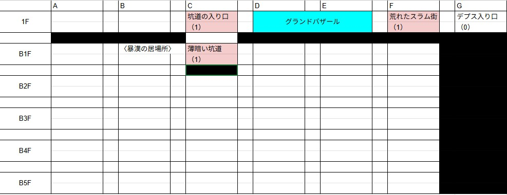
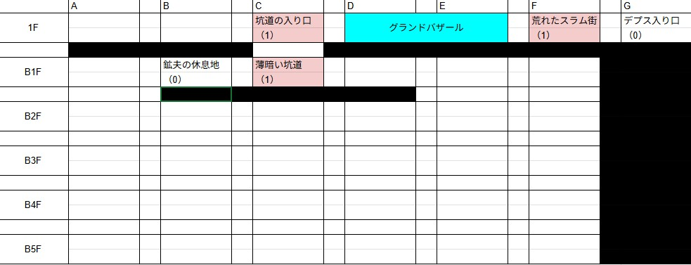

卓の基本情報は[こちら](./info.md)

---

# 第1話

## ◉ 導入
### ◆ ネヴィリムの過去
- あなたはかつて屈強な男軍人だった
- 魔動機文明時代、あなたは蛮族の侵攻を食い止めるための兵士として働いていた
  - 銃の名手として周辺国家に名が通っている英雄であった
  - そんな貴方に特別な出撃命令が下る
    - 蛮族の拠点への強襲を命じられた
  - 出撃前、「サッチャー」という友人に声をかけられる
    - どうやらサッチャーも先の任務に一緒に参加するらしい
      - 少数による内部浸透、内部からの破壊だそうだ
        - この仕事が終われば1ヶ月の休暇らしい
#### ▼ 任務当日
- 内部浸透に成功し、爆破装置を仕掛けた
  - あと5分で蛮族の拠点は爆発四散だ
  - 危険感知：**成功**
    - 背後から蛮族が近づいてきていた！
      - 棍棒で殴りかかろうとしていた蛮族を銃で射抜く
      - 意図した殴打は避けられたが、移動の慣性により、倒れてきた蛮族の棍棒がぶつかってしまう
        - サッチャーに助けられながら、既のところで脱出した！

#### ▼ 病院
- ベッドで横たわって治療を受けている
  - 医師が検査結果を持ってきた
    - いい話と悪い話があるそうだ
      - いい話
        - 怪我は確実に直る程度の怪我らしい
      - 悪い話
        - 完治までに5年掛かってしまうらしい
          - 首の骨と脊髄に大きな損傷を受けたらしい
            - コールドスリープを使用したナノマシン治療法が選択されたらしい
              - これにより問題なく治療ができるそうだ
            - 治療を承諾した
- コールドスリープを開始した

#### ▼ コールドスリープへ
- コールドスリープ中のはずなのに意識がある
  - 暗闇の中に取り残されたような感覚がある
  - ここは夢の中のようだ
- 不安に思っているとこちらを呼ぶ声がある
  - 無意識に、声のする方に歩いていく
    - 近づくと、少女がいた
      - 少女は「ツグ」というらしい
        - お願いごとがあるそうだ
          - このままでは人類・蛮族・魔神関係なく全員死ぬからそれを何とかしてほしい、目覚めたら煙の発生源に向かって、とのことだ
        - ただ、一つ想定外のことがあったらしい
          - ごめんね、とのこと

#### ▼ 目覚め
- 眠っていたポッドが開く
- コールドスリープから目覚めたようだ
- 身体に重みを感じる
- ポッド周辺は、半壊状態だ
  - 周辺には武装した兵士がいる
    - 聞こえる話だと、ここのルーンフォーク工廠は故障しているそうだ……
    - 銃を持った兵士がこちらに近づいてくる
      - 兵士に水を求めると、水をくれた
      - 兵士はスターピースカンパニーの社員を名乗っている
        - 発掘作業をしているそうだ
    - 兵士との話が合わないため、兵士が鏡を渡してくれた
      - 身体が女性のものになっていた……
- カンパニーに保護された……

#### ▼ 数ヶ月後
- 1ヶ月くらい後、カンパニー幹部の「ジェイド」という女性に呼び出された
  - 長期の依頼があるらしい
    - 友人の護衛とのこと
      - 終了期限は定めず、終了を宣言するまでは護衛をしてほしいとのこと
        - スピカという少女が来た
          - 彼女を護衛してほしいらしい
      - 彼女を連れ、「オーバーデプス」という鉱床に向かってほしいとのこと
      - そこでしか取れない鉱石の流通ラインをスピカが確保する間の護衛を頼まれた
        - 依頼を承諾した

## ◉ 「オーバーデプス」へ
- ティナ以外のメンバーは、それぞれオーバーデプスのグランドバザールへ来ている
  - 初心者であるこちらに様々な商品を売りつけようとしている
  - 宿の客引きも来た
  - 真偽：**成功**（リラ・スピカ）
    - ぼったくりだ。宿を無視しよう
- 探索：**成功**
  - ラプラスという宿がある
    - 良さそうな宿だ
    - 中に入ろう
      - 10歳前後の子どもがこちらに話しかけてくる
        - 宿の受付のようだ
          - 少女の名前は「ハル」というらしい
          - 宿の条件を色々と聞き、ここに泊まることになった
  - ティナが話しかけた
    - いろいろあってパーティに合流した！
      - お互いに自己紹介をした！

## ◉ 隣の酒場で聞き込み
- スピカが宿の隣にある、酒場の店主の少年に聞き込み
  - 店主はハルと言うらしい
  - ゴールドラッシュという集団があるらしい
    - 彼らはヒヒイロカネを採掘、その後に武具などに加工して、対外向けの商売をしているらしい
  - 他にもいくつか集団があるが、一番話しやすい相手だろうとのこと
  - ネヴィリムが店主に、地図があるかを聞いた
    - あるにはあるが、役に立たないそうだ
    - どんどん坑道ができているそうだ
      - また、時折、道に『門』ができるそうで、そこをくぐると、まったく違う場所に飛ばされるらしい
      - そういった事情もあり、自分の足で開拓したほうが良いとのこと
- 店主と話していると、勢いよく背後のドアが開く
  - 男が勢いよく入ってきた
    - 男は「ゴンザレス」というそうだ
    - 何か大事があったらしい
      - 男のリーダーが捕まったらしい！
      - 鉱石を掘っていたら、鉱石を強奪され、リーダーや他のメンバーが捕まったらしい
    - 助けに行こう！
      - ハルも同行するらしい

## ◉ グランドバザールの外へ
- 時間は以下の通り管理される
  | 名前 | 時間帯 |
  |:---:|:---:|
  | 朝 | 6 - 9 時 |
  | 昼 | 10 - 13 時 |
  | 午後 | 14 - 17 時 |
  | 夜 | 18 - 21 時 |
  | 深夜 | 22 - 1 時 |
  | 未明 | 2 - 5 時 |
  - 1マス進むごとに1つ段階が進む
  - [地下探索]判定は1Dで行われる
    - カッコ内の数値以下だった場合、バッドイベントが起きる
  - [周辺探索]は2Dで行われる
    - 1回までなら時間進行なし
    - 以降は1回ごとに、1つ段階が進む
- 周辺の地図が更新された！
  - 

## ◉ 坑道の入口 1-1（午後）
- [地下探索]：**5**
  - 特に何も起こらなかった
- [周辺探索]：**10**
  - 革袋が落ちている
    - ヒヒイロカネ金貨だ！
      - 〈ヒヒイロカネ金貨〉を1枚手に入れた！

## ◉ 薄暗い坑道 2-1（夜）
- 周辺の地図が更新された！
  - 
- [地下探索]：**2**
  - 特に何も起こらなかった
- [周辺探索]：**7**
  - 危険感知：**成功**
    - 地面に鳴子がある！　避ける事ができた！

## ◉ 鉱夫の休息地 3-1（深夜）
- 周辺の地図が更新された！
  - 
- 坑道の横に簡素な部屋が掘られている
  - 鉱夫の休息場のようだ
  - 少し奥の広間に10人ほどの集団がいる
    - 鉱夫たちを縛り付けている
      - ゴンザレス曰く、奴儕めが襲ってきたらしい
        - 半分くらいはハルが引き受けてくれるそうだ
- 危険感知：**成功**
  - 背後から奴らの仲間が近づいていた！
    - 戦闘だ！

### ◆ 暴漢らとの戦闘（1 戦目）
- 魔物知識：**成功**（弱点値まで）
  - はぐれの暴漢 x 6
    > ### ▽ はぐれの暴漢
    >
    > | 知能 | 種族 | 知名度／弱点値 | 弱点 | 先制値 |
    > |:---:|:---:|:---:|:---:|:---:|
    > | 人間 | 人族 | 6／12 | 全ダメージ+3 | 12 |
    >
    > | ＨＰ | ＭＰ | 生命抵抗力 | 精神抵抗力 | 回避力 | 防護点 |
    > |:---:|:---:|:---:|:---:|:---:|:---:|
    > | 30 | 10 | 14 | 10 | 12 | 3 |
    >
    > #### 攻撃方法
    >
    > | 攻撃方法 | 命中力 | 打撃点 |
    > |:---:|:---:|:---:|
    > | ハンマー | 12 | 2d+5 |
    >
    > #### 特殊能力
    >
    > ##### 〇ねずみの意地
    >
    > * HPが0になる攻撃を受けたとき1度だけHP1で耐える
- 先制：**成功**
- 結果：**勝利**
  - 味方が削った敵を、スピカのファイアボルトで一掃！

#### ▼ 戦利品
- 360 G
- 任意のAカード x 1

### ◆ 戦闘後
- 戦闘を終えるとゴンザレスが近づいてきた
  - こちらを褒めてくれた
  - ハルたちを追いかけよう！
- 足跡追跡：**成功**
  - 足跡を探すことができた！
  - 先は迷いそうな構造をしているが、足跡を追跡できているため追えるぞ！

### ◆ 洞窟の奥
- リーダー格のような人族がいる
  - 周りには山賊どもが倒れている
    - ハルが倒したようだ
- 加勢しよう
  - 戦闘だ！

### ◆ 山賊頭との戦闘（2 戦目）
- 魔物知識：**成功**（弱点値まで）
  - 山賊の頭 x 1
    > ### ▽ 盗賊の頭
    >
    > | 知能 | 種族 | 知名度／弱点値 | 弱点 | 先制値 |
    > |:---:|:---:|:---:|:---:|:---:|
    > | 人間 | 人族 | 10／14 | 物理ダメージ+5 | 12 |
    >
    > | ＨＰ | ＭＰ | 生命抵抗力 | 精神抵抗力 | 回避力 | 防護点 |
    > |:---:|:---:|:---:|:---:|:---:|:---:|
    > | 180 | 100 | 12 | 10 | 14 | 5 |
    >
    > #### 攻撃方法
    >
    > | 攻撃方法 | 命中力 | 打撃点 |
    > |:---:|:---:|:---:|
    > | シャムシール | 15 | 3d+10 |
    >
    > #### 特殊能力
    >
    > ##### 〇エンハンサー・レベル3
    >
    > * キャッツアイ・マッスルベアー・ガゼルフッド
    >
    > ##### 〇連撃Ⅰ
    >
    > * シャムシールによる攻撃が命中したとき、同じ対象に再び攻撃する。
    >   この効果はﾗｳﾝﾄﾞ1回発動する
    >
    > ##### 〇ねずみの意地
    >
    > * HPが0になる攻撃を受けたとき1度だけHP1で耐える
- 先制：**成功**
- 結果：**勝利！**
  - ティナのダークミストで敵の回避を下げる！
  - 続くスピカがスネアで相手を転倒させる！
  - メリアベルがクリティカル！　1回転だ！
  - ミュシカがクリティカル！　1回転だ！
  - メリアベルがクリティカル！　1回転だ！
  - ミュシカがファンブル……
    - 運命変転！　命中だ！
      - 1回転！　クリティカルだ！
  - ネヴィリムの2連撃でトドメだ！

#### ▼ 戦利品
- ヒヒイロカネ金貨 x 1

### ◆ 戦闘後
- 山賊頭は命乞いをしている！
  - とりあえず縛り上げた！
- 鉱夫たちを解放した！
- ネヴィリムが、鉱夫のリーダーに、変わったことがないかを聞いた
  - 鉱床の地下で変な病が流行っているらしい
    - 皮膚に黒い点が少しずつ増えるらしい
      - 最後には全身が真っ黒になって死んでしまうらしい
        - 夢で見たものかもしれない……
    - かなり深層でしか発生していないとのこと

## ◉ 酒場への帰還
- 山賊頭を衛兵に引き渡した！
  - 賞金がかかっていたらしい……報酬に期待しよう！
- ハルからお礼を言われた！
  - 「[“グランドバザールの主”ハル](https://trpg.x0.to/ytsheet2/sw2.5/?id=a6O1id)」のデータが開示された！
- ハルから、これから酒場で依頼を受けないか、と持ちかけられた
  - 承諾した！
- 皆で話しているときに、リラとミュシカの復讐相手が同じそうだということが分かった……

---

**シナリオ終了！**

## ◉ 報酬
|報酬|内容|
|:---:|:---:|
|経験点| 2,500 点|
|成長| 2 回|
|ガメル| 7,500 G|
|名誉点| 30 点|
|ヒヒイロ硬貨| 2 枚 |
