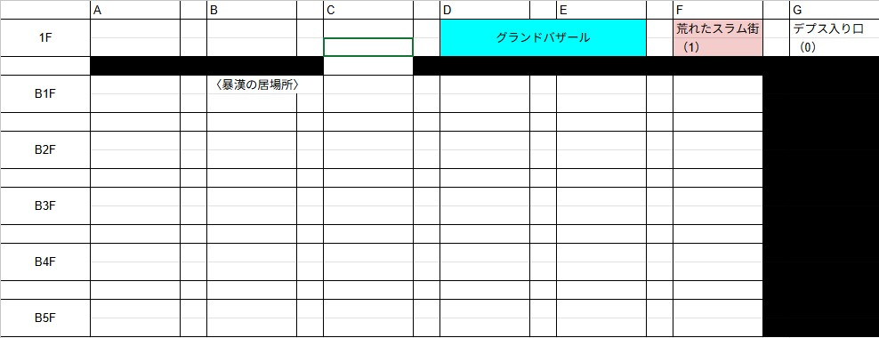
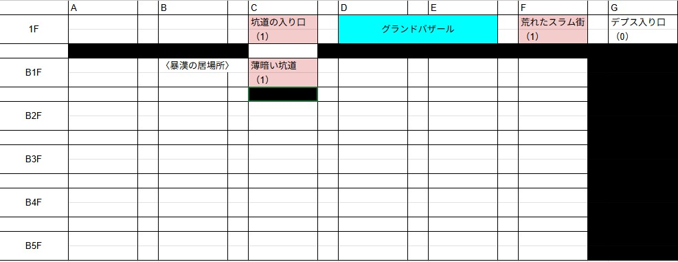
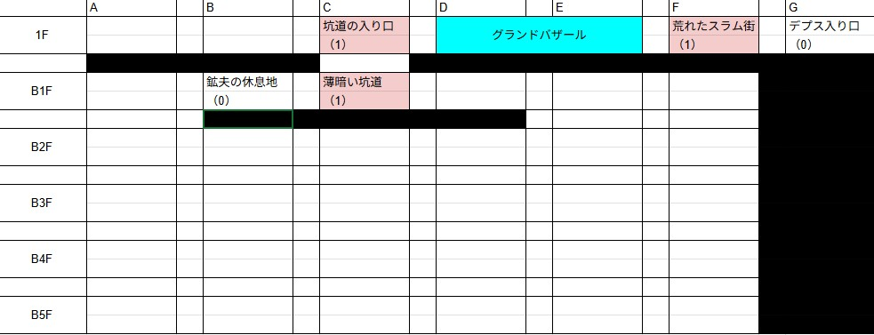

卓の基本情報は[こちら](./info.md)

---

# 第1話

## ◉ 導入（ネヴィリム）
### ◆ 過去
- あなたはかつて屈強な男軍人だった
- 魔動機文明時代、あなたは蛮族の侵攻を食い止めるための兵士として働いていた
  - 銃の名手として周辺国家に名が通っている英雄であった
  - そんな貴方に特別な出撃命令が下る
    - 蛮族の拠点への強襲を命じられた
  - 出撃前、「サッチャー」という友人に声をかけられる
    - どうやらサッチャーも先の任務に一緒に参加するらしい
      - 少数による内部浸透、内部からの破壊だそうだ
        - この仕事が終われば1ヶ月の休暇らしい
#### ▼ 任務当日
- 内部浸透に成功し、爆破装置を仕掛けた
  - あと5分で蛮族の拠点は爆発四散だ
  - 危険感知：**成功**
    - 背後から蛮族が近づいてきていた！
      - 棍棒で殴りかかろうとしていた蛮族を銃で射抜く
      - 意図した殴打は避けられたが、移動の慣性により、倒れてきた蛮族の棍棒がぶつかってしまう
        - サッチャーに助けられながら、既のところで脱出した！

#### ▼ 病院
- ベッドで横たわって治療を受けている
  - 医師が検査結果を持ってきた
    - いい話と悪い話があるそうだ
      - いい話
        - 怪我は確実に直る程度の怪我らしい
      - 悪い話
        - 完治までに5年掛かってしまうらしい
          - 首の骨と脊髄に大きな損傷を受けたらしい
            - コールドスリープを使用したナノマシン治療法が選択されたらしい
              - これにより問題なく治療ができるそうだ
            - 治療を承諾した
- コールドスリープを開始した

#### ▼ コールドスリープへ
- コールドスリープ中のはずなのに意識がある
  - 暗闇の中に取り残されたような感覚がある
  - ここは夢の中のようだ
- 不安に思っているとこちらを呼ぶ声がある
  - 無意識に、声のする方に歩いていく
    - 近づくと、少女がいた
      - 少女は「ツグ」というらしい
        - お願いごとがあるそうだ
          - このままでは人類・蛮族・魔神関係なく全員死ぬからそれを何とかしてほしい、目覚めたら煙の発生源に向かって、とのことだ
        - ただ、一つ想定外のことがあったらしい
          - ごめんね、とのこと

#### ▼ 目覚め
- 眠っていたポッドが開く
- コールドスリープから目覚めたようだ
- 身体に重みを感じる
- ポッド周辺は、半壊状態だ
  - 周辺には武装した兵士がいる
    - 聞こえる話だと、ここのルーンフォーク工廠は故障しているそうだ……
    - 銃を持った兵士がこちらに近づいてくる
      - 兵士に水を求めると、水をくれた
      - 兵士はスターピースカンパニーの社員を名乗っている
        - 発掘作業をしているそうだ
    - 兵士との話が合わないため、兵士が鏡を渡してくれた
      - 身体が女性のものになっていた……
- カンパニーに保護された……

#### ▼ 数ヶ月後
- 1ヶ月くらい後、カンパニー幹部の「ジェイド」という女性に呼び出された
  - 長期の依頼があるらしい
    - 友人の護衛とのこと
      - 終了期限は定めず、終了を宣言するまでは護衛をしてほしいとのこと
        - スピカという少女が来た
          - 彼女を護衛してほしいらしい
      - 彼女を連れ、「オーバーデプス」という鉱床に向かってほしいとのこと
      - そこでしか取れない鉱石の流通ラインをスピカが確保する間の護衛を頼まれた
        - 依頼を承諾した

## ◉ 「オーバーデプス」へ
- ティナ以外のメンバーは、それぞれオーバーデプスのグランドバザールへ来ている
  - 初心者であるこちらに様々な商品を売りつけようとしている
  - 宿の客引きも来た
  - 真偽：**成功**（リラ・スピカ）
    - ぼったくりだ。宿を無視しよう
- 探索：**成功**
  - ラプラスという宿がある
    - 良さそうな宿だ
    - 中に入ろう
      - 10歳前後の子どもがこちらに話しかけてくる
        - 宿の受付のようだ
          - 少女の名前は「ハル」というらしい
          - 宿の条件を色々と聞き、ここに泊まることになった
  - ティナが話しかけた
    - いろいろあってパーティに合流した！
      - お互いに自己紹介をした！

## ◉ 隣の酒場で聞き込み
- スピカが宿の隣にある、酒場の店主に聞き込み
  - ……といってもこっちもハルらしいが
  - ゴールドラッシュという集団があるらしい
    - 彼らはヒヒイロカネを採掘、その後に武具などに加工して、対外向けの商売をしているらしい
  - 他にもいくつか集団があるが、一番話しやすい相手だろうとのこと
  - ネヴィリムが店主に、地図があるかを聞いた
    - あるにはあるが、役に立たないそうだ
    - どんどん坑道ができているそうだ
      - また、時折、道に『門』ができるそうで、そこをくぐると、まったく違う場所に飛ばされるらしい
      - そういった事情もあり、自分の足で開拓したほうが良いとのこと
- 店主と話していると、勢いよく背後のドアが開く
  - 男が勢いよく入ってきた
    - 男は「ゴンザレス」というそうだ
    - 何か大事があったらしい
      - 男のリーダーが捕まったらしい！
      - 鉱石を掘っていたら、鉱石を強奪され、リーダーや他のメンバーが捕まったらしい
    - 助けに行こう！
      - ハルも同行するらしい

## ◉ グランドバザールの外へ
- 時間は以下の通り管理される
  | 名前 | 時間帯 |
  |:---:|:---:|
  | 朝 | 6 - 9 時 |
  | 昼 | 10 - 13 時 |
  | 午後 | 14 - 17 時 |
  | 夜 | 18 - 21 時 |
  | 深夜 | 22 - 1 時 |
  | 未明 | 2 - 5 時 |
  - 1マス進むごとに1つ段階が進む
  - [地下探索]判定は1Dで行われる
    - カッコ内の数値以下だった場合、バッドイベントが起きる
  - [周辺探索]は2Dで行われる
    - 1回までなら時間進行なし
    - 以降は1回ごとに、1つ段階が進む
- 周辺の地図が更新された！
  - 

## ◉ 坑道の入口 1-1（午後）
- [地下探索]：**5**
  - 特に何も起こらなかった
- [周辺探索]：**10**
  - 革袋が落ちている
    - ヒヒイロカネ金貨だ！
      - 〈ヒヒイロカネ金貨〉を1枚手に入れた！

## ◉ 薄暗い坑道 2-1（夜）
- 周辺の地図が更新された！
  - 
- [地下探索]：**2**
  - 特に何も起こらなかった
- [周辺探索]：**7**
  - 危険感知：**成功**
    - 地面に鳴子がある！　避ける事ができた！

## ◉ 鉱夫の休息地 3-1（深夜）
- 周辺の地図が更新された！
  - 
- 坑道の横に簡素な部屋が掘られている
  - 鉱夫の休息場のようだ
  - 少し奥の広間に10人ほどの集団がいる
    - 鉱夫たちを縛り付けている
      - ゴンザレス曰く、奴儕めが襲ってきたらしい
        - 半分くらいはハルが引き受けてくれるそうだ
- 危険感知：**成功**
  - 背後から奴らの仲間が近づいていた！
    - 戦闘だ！

### ◆ 暴漢らとの戦闘（1 戦目）
- 魔物知識：**成功**（弱点値まで）
  - はぐれの暴漢 x 6
    > ### ▽ はぐれの暴漢
    >
    > | 知能 | 種族 | 知名度／弱点値 | 弱点 | 先制値 |
    > |:---:|:---:|:---:|:---:|:---:|
    > | 人間 | 人族 | 6／12 | 全ダメージ+3 | 12 |
    >
    > | ＨＰ | ＭＰ | 生命抵抗力 | 精神抵抗力 | 回避力 | 防護点 |
    > |:---:|:---:|:---:|:---:|:---:|:---:|
    > | 30 | 10 | 14 | 10 | 12 | 3 |
    >
    > #### 攻撃方法
    >
    > | 攻撃方法 | 命中力 | 打撃点 |
    > |:---:|:---:|:---:|
    > | ハンマー | 12 | 2d+5 |
    >
    > #### 特殊能力
    >
    > ##### 〇ねずみの意地
    >
    > * HPが0になる攻撃を受けたとき1度だけHP1で耐える
- 先制：**成功**
- 結果：**勝利**
  - 味方が削った敵を、スピカのファイアボルトで一掃！

#### ▼ 戦利品
- 360 G
- 任意のAカード x 1

### ◆ 戦闘後
- 戦闘を終えるとゴンザレスが近づいてきた
  - こちらを褒めてくれた
  - ハルたちを追いかけよう！
- 足跡追跡：**成功**
  - 足跡を探すことができた！
  - 先は迷いそうな構造をしているが、足跡を追跡できているため追えるぞ！

### ◆ 洞窟の奥
- リーダー格のような人族がいる
  - 周りには山賊どもが倒れている
    - ハルが倒したようだ
- 加勢しよう
  - 戦闘だ！

### ◆ 山賊頭との戦闘（2 戦目）
- 魔物知識：**成功**（弱点値まで）
  - 山賊の頭 x 1
    > ### ▽ 盗賊の頭
    >
    > | 知能 | 種族 | 知名度／弱点値 | 弱点 | 先制値 |
    > |:---:|:---:|:---:|:---:|:---:|
    > | 人間 | 人族 | 10／14 | 物理ダメージ+5 | 12 |
    >
    > | ＨＰ | ＭＰ | 生命抵抗力 | 精神抵抗力 | 回避力 | 防護点 |
    > |:---:|:---:|:---:|:---:|:---:|:---:|
    > | 180 | 100 | 12 | 10 | 14 | 5 |
    >
    > #### 攻撃方法
    >
    > | 攻撃方法 | 命中力 | 打撃点 |
    > |:---:|:---:|:---:|
    > | シャムシール | 15 | 3d+10 |
    >
    > #### 特殊能力
    >
    > ##### 〇エンハンサー・レベル3
    >
    > * キャッツアイ・マッスルベアー・ガゼルフッド
    >
    > ##### 〇連撃Ⅰ
    >
    > * シャムシールによる攻撃が命中したとき、同じ対象に再び攻撃する。
    >   この効果はﾗｳﾝﾄﾞ1回発動する
    >
    > ##### 〇ねずみの意地
    >
    > * HPが0になる攻撃を受けたとき1度だけHP1で耐える
- 先制：**成功**
- 結果：**勝利！**
  - ティナのダークミストで敵の回避を下げる！
  - 続くスピカがスネアで相手を転倒させる！
  - メリアベルがクリティカル！　1回転だ！
  - ミュシカがクリティカル！　1回転だ！
  - メリアベルがクリティカル！　1回転だ！
  - ミュシカがファンブル……
    - 運命変転！　命中だ！
      - 1回転！　クリティカルだ！
  - ネヴィリムの2連撃でトドメだ！

#### ▼ 戦利品
- ヒヒイロカネ金貨 x 1

### ◆ 戦闘後
- 山賊頭は命乞いをしている！
  - とりあえず縛り上げた！
- 鉱夫たちを解放した！
- ネヴィリムが、鉱夫のリーダーに、変わったことがないかを聞いた
  - 鉱床の地下で変な病が流行っているらしい
    - 皮膚に黒い点が少しずつ増えるらしい
      - 最後には全身が真っ黒になって死んでしまうらしい
        - 夢で見たものかもしれない……
    - かなり深層でしか発生していないとのこと

## ◉ 酒場への帰還
- 山賊頭を衛兵に引き渡した！
  - 賞金がかかっていたらしい……報酬に期待しよう！
- ハルからお礼を言われた！
  - 「[“グランドバザールの主”ハル](https://trpg.x0.to/ytsheet2/sw2.5/?id=5q9xSA)」のデータが開示された！
- ハルから、これから酒場で依頼を受けないか、と持ちかけられた
  - 承諾した！
- 皆で話しているときに、リラとミュシカの復讐相手が同じそうだということが分かった……

**シナリオ終了！**

## ◉ 報酬
|報酬|内容|
|:---:|:---:|
|経験点| 2,500 点|
|成長| 2 回|
|ガメル| 7,500 G|
|名誉点| 30 点|
|ヒヒイロ硬貨| 2 枚 |

---

# 第2話

## ◉ 導入（メリアベル）
### ◆ 過去
- 幼い頃にエルフの老貴族に拾われて、実の娘のように愛されていた
  - 義母に、やってみたいことはないかと訊かれた
    - 退屈そうに見えるそうだ
      - 冒険をしてみたいと答える
        - それはダメ、と返された
          - 老貴族の息子は冒険に行って帰ってこなかったらしい
      - 代わりに勧められたピアノを習うことになった
        - 10日も習っていると、難しい旋律を難なく弾けるようになってしまった
          - 講師も驚く速度だ
        - ピアノも結局退屈だ……
    - 他にやってみたいことはないか、と訊かれた
      - やっぱり冒険に出たい
        - 冒険だけはダメ、と返される
      - では、ピアノ以外の楽器をやってみたいと返した
        - バイオリンを習うことに
          - バイオリンも1ヶ月もしないうちに難なく弾けるようになってしまった
            - 講師よりも上手くなってしまった……
    - フェンシングを勧められた
      - 剣術の先生に習ったが、1ヶ月もしないうちに先生より強くなってしまった
- そんなことが続いたある日
  - ため息を付いたように義母が話しかけてくる
    - こんなにも才に溢れていたとは、と言われた
      - 冒険よりも楽しそうなことはあるか、と訊かれた
        - 何をやっても退屈だ、と答えた
        - 冒険がダメなら本がいい
          - 来る日も来る日も本を読む生活が続いた
            - しかし、冒険をしたい欲は止まらず、そわそわとしてしまう日々だ
- 寝る前に、義母が訪れた
  - 明日の夜まで義父は戻らないそうだ
    - そわそわとしていたことに勘付かれたそうだ
    - もし出るなら今しかない、と言われ、レイピアを渡された
      - 義父母の息子の遺品だそうだ
        - メリアベルにくれるらしい
  - 定期的に手紙を書いてほしい、と言われた
    - 承諾する
  - メリアベルからもお願いをした
    - 勝手に家出をした、として欲しいと頼んだ
      - 承諾をしてもらった
- 義母の視線を背に、旅立ったのであった……

### ◆ 冒険者として
- 冒険者としての才があったようで、トントン拍子に地位を高めていく
  - そんな中、ある人間に声をかけられる
    - 「スターピースカンパニー社員　ヨハン」と書いてある名刺を渡された
      - スターピースカンパニーはここらではかなり大規模な会社だ
    - ヨハンは、高まるメリアベルの名を聞き、直接依頼にきたらしい
      - 長期間かつ、そこそこ危険な依頼らしい
        - まずはお話を、とのこと
          - 訊くことにした
      - オーバーデプス、という巨大な鉱床を含む都市に送り込む社員の護衛を探しているそうだ
        - 期間は短くて1ヶ月ほどらしい
          - 成功報酬は最低10万ガメルとのこと
        - 依頼を受諾することにした
          - 明日にはここを発てるように準備して欲しい、とのこと
            - 準備をしよう！
- 以降はネヴィリムの導入に続く……

## ◉ 宿屋『ラプラス』 1-1（朝）
- 寝室から出て、ロビーに出ると、ハルが声をかけてきた
  - 挨拶をする
- 奥から料理人が出てきた
  - バジリスク！　蛮族だ！
    - しかし、大変穏やかで理知的だ
      - 「トロピア」というらしい
        - トロピアは亡くなった友人の生まれ変わりを探しに、オーバーデプスにいるそうだ
          - グラスランナーの男性で、「ヘリオ」というらしい
      - 起きていたうち、リラとスピカは手伝うことに
      - ティナは「勤労精神大変結構！　はやく料理を持ってきてくれたまえ！」と座っている
        - いつも通りだ
- 他のメンバーも降りてきた
  - 酒場では、鉱夫たちが、リラやスピカの郷土料理を食べている
- 食事を終えると、一人の女性客がやってきた
  - ハルの客らしい
    - 聞き耳：**成功**
      - メリアベルがクリティカル！
      - 最近薬不足らしい
        - 薬の卸業者が撤退したそうだ
          - 跡継ぎがいないらしい
        - それ以来、薬の卸業者が1つになってしまい、不当に値を釣り上げて暴利を貪っているようだ
          - 大体薬価が10倍になっているそうだ
      - ハルに解決を依頼して、封筒を置いていった
        - カンパニー関係の軍票だろうか
- ネヴィリムはハルに話を聞きに行った
  - 事情を聞いた
    - ネヴィリムといっしょに事情を聞いたスピカは、席を外してカンパニーに問い合わせをした
      - 薬草の輸入ルートを確保した！　組織を潰しても大丈夫だ！
  - その間、ゴンザレスが来た
    - 救命草がないらしい
  - 身なりの整った冒険者が来た
    - 救命草の値段が暴利だと訴えている
  - 慌てているハルのところにスピカが戻ってくる
    - 薬草の輸入ルートを確保したことを伝える
  - 成敗しに行こう！
- 薬草を売ってる商人を見に行こう
  - あくどい女商人だ……
    - 商人を挑発した！
      - 東口で待ってろ、と言われた

## ◉ グランドバザール 東口 2-1（昼）
- 東口に向かう途中、トロピアが追いかけてきた
  - ハルから言われ、戦いを見学したいらしい
    - 承諾した
      - 遠くから、関係者であることがバレないように尾行するそうだ
- 女商人がいた
  - 女商人の元々の護衛は今日で契約が切れるらしい
    - 何度止めても諦めないことから、護衛の仕事は辞すようだ
    - すると、女商人が別に雇った護衛が出てきた
  - 戦闘だ！

### ◆ 女商人「アイド」らとの戦闘（1 戦目）
- 魔物知識：**成功**
  - [3人組の盗賊](https://trpg.x0.to/ytsheet2/sw2.5/?id=hb3dBp) x 3
    > ### ▽ 3人組の盗賊
    >
    > | 分類 | 知能 | 知覚 | 反応 |
    > |:---:|:---:|:---:|:---:|
    > | 人族 | 人間 | 五感 | 敵対的 |
    >
    > | 言語 | 生息地 | 知名度／弱点値 | 弱点 |
    > |:---:|:---:|:---:|:---:|
    > |  |  | 9／14 | 物理ダメージ+5点 |
    >
    > | 先制値 | 移動速度 |
    > |:---:|:---:|
    > | 13 | 10 |
    >
    > | ＨＰ | ＭＰ | 生命抵抗力 | 精神抵抗力 | 回避力 | 防護点 |
    > |:---:|:---:|:---:|:---:|:---:|:---:|
    > | 75 | 20 | 8 (15) | 8 (15) | 8 (15) | 5 |
    >
    > #### 攻撃方法
    >
    > | 攻撃方法 | 命中力 | 打撃点 |
    > |:---:|:---:|:---:|
    > | ナイフ | 9 (16) | 2d+15 |
    >
    > #### 特殊能力
    >
    > ##### 〇3人の連携
    >
    > * 自分以外の「3人組の盗賊」一人につき、命中+1
    >
    > #### 解説
    >
    > 仲のいい３人組の盗賊。常に３人で行動している。
    >
    > その連携によって、その手のナイフの正確性は凄まじい。
  - [悪徳輸入業者](https://trpg.x0.to/ytsheet2/sw2.5/?id=NzL9dl) x 1
    > ### ▽ 悪徳輸入業者
    >
    > | 分類 | 知能 | 知覚 | 反応 |
    > |:---:|:---:|:---:|:---:|
    > | 人族 | 人間 | 五感（暗視） | 中立 |
    >
    > | 言語 | 生息地 | 知名度／弱点値 | 弱点 |
    > |:---:|:---:|:---:|:---:|
    > |  |  | 12／16 | 全ダメージ+2点 |
    >
    > | 先制値 |
    > |:---:|
    > | 15 |
    >
    > | ＨＰ | ＭＰ | 生命抵抗力 | 精神抵抗力 | 回避力 | 防護点 |
    > |:---:|:---:|:---:|:---:|:---:|:---:|
    > | 200 | 100 | 10 (17) | 10 (17) | 8 (15) | 4 |
    >
    > #### 攻撃方法
    >
    > | 攻撃方法 | 命中力 | 打撃点 |
    > |:---:|:---:|:---:|
    > | 仕込み杖 | 10 (17) | 2d+10 |
    >
    > #### 特殊能力
    >
    > ##### 〇コンジャラー・レベル5・魔力9
    >
    > ##### 〇高速詠唱Ⅰ
    >
    > * 攻撃方法に追加して、呪文を1回詠唱する。
    >
    > ##### 〇魔法適正
    >
    > * 魔法拡大/数、ターゲッティングを所持。
    >
    > ##### 〇集団防御
    >
    > * 複数を対象とする攻撃のダメージを5点軽減する。
    >
    > ##### 〇背水の戦い
    >
    > * 味方が自分のみの場合、「仕込み杖」を2回使用するようになる。
    > * さらに、高速詠唱の効果がⅡとなり、2回呪文を使うようになる。
    >
    > #### 戦利品
    >
    > | 出目 | 戦利品 |
    > |:---:|:---:|
    > | 自動 | ヒヒイロ硬貨*2 |
    > | 9以上 | 任意のSカード*1 |
    >
    > #### 解説
    >
    > 元はただの薬の商人だったが、ほかの業者が撤退したことをきっかけにデプス内での薬の卸を独占し、暴利を得ていた。
- 先制：**成功**
- 結果：**勝利！**
  - スピカのスネアで敵前衛が全員転倒！
  - リラがクリティカル！　1回転！
  - ミュシカがファンブル……
  - ネヴィリムがファンブル……
    - 運命変転！　命中！
  - メリアベルがクリティカル！　1回転！

#### ▼ 戦利品判定
- 820 G
- ヒヒイロ硬貨 x 2

### ◆ 戦闘後
- アイドに勝利した！
  - 暴利を貪っていたのは事実だが、目利き自体は正確だ、とスピカが告げる
    - ここを去る予定で、その前に一儲けしてやろうと思っただけらしい
  - やり直す機会を与えた
- そうしていると、女性が魔動バイクでこちらに来た
  - 「トパーズ」というらしい
    - スピカの知り合いのようだ
    - アイドはイチからやり直すために、トパーズに商店や在庫を引き取って欲しいそうだ
      - トパーズと話し合いに行った
- アイドの元々の護衛を務めていた「ワン」を証人としてギルドに連れて行った
  - 証言をしてもらったあと、ワンをトパーズの護衛として紹介した！
    - 〈ヒヒイロ硬貨〉 x 1 をくれた！
- ワンの話を聞いていると、ハルとトロピアはどうやらお偉いさんのようだ……
  - ハルはグランドバザールのギルド長だそうだ
    - ハルは何かを言いかけた
      - 冒険者+知力：**成功**
        - 「ゴールドラッシュ」と言いかけたようだ

**シナリオ終了！**

## ◉ 報酬
|報酬|内容|
|:---:|:---:|
|経験点| 4,000 点|
|成長| 3 回|
|ガメル| 5,136 G|
|名誉点| 50 点|
|ヒヒイロ硬貨| 3 枚 |

---

# 第3話

## ◉ 導入（スピカ）
### ◆ 過去
- 円満な夫婦の子どもとして生まれたが、村が強盗に襲われ、多くの村人は死んでしまった
  - スピカは珍しい種であることから、強盗の所持する列車に連れ込まれた
- 列車の中で暴漢どもに蹴られる
  - 強盗のリーダーらしき男が商品に傷つけるなと止めてきた
  - 女に見えるスピカだが、実は男だ
    - 商品価値が下がったことを残念がっていたが、売られることには代わりがないようだ
- 暴漢のリーダーのご飯が来ていないそうで、下っ端に見に行かせた
  - そのとき、銃声が鳴った
    - 別の勢力による襲撃……？
      - いや、カンパニーの社員だ！
        - 村はカンパニーの管轄で、駐在員の不在中に襲われたことから、奪還に動いたようだ
          - 強盗は生け捕りにされた
            - 上層部の命令らしい
  - スピカは社員に助けてもらった

### ◆ カンパニーへ
- 社員に護送され、カンパニーへとたどり着いた
  - スピカは、一時的にカンパニーで保護されることになった
- しばらくした後、カンパニー側から選択肢が掲示された
  - 選択肢は3つ
    - ひとつは、カンパニーで保護される
    - もうひとつは、里親に引き取ってもらう
    - 最後は、ここから単独で出る
      - 幼いこともあり、最後の選択肢は取らないほうがいい、と言われた
  - 怖くないところがいい、と答えた
- そこに桃色の髪をした一人の女性が来た
  - 社長だそうだ。名前は「ジェイド」
    - ここでの生活について訊かれた
      - こわくないけどさみしい、と答えた
    - 商人を目指す気はないかと言われた
      - ジェイドの後継として
    - 商人を目指すことになった

### ◆ 数年後
- 商人としてのイロハを叩き込まれたスピカは、人間不信をだいぶ克服できていた
  - ジェイドから、ヒヒイロカネの任務を与えられた
  - メリアベルとネヴィリムの紹介を受けた

## ◉ 宿屋『ラプラス』 1-1（朝）
