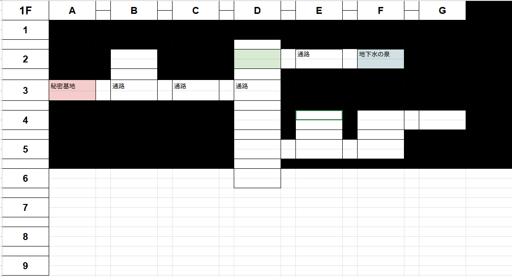
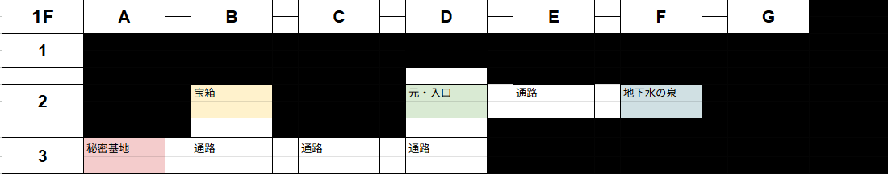
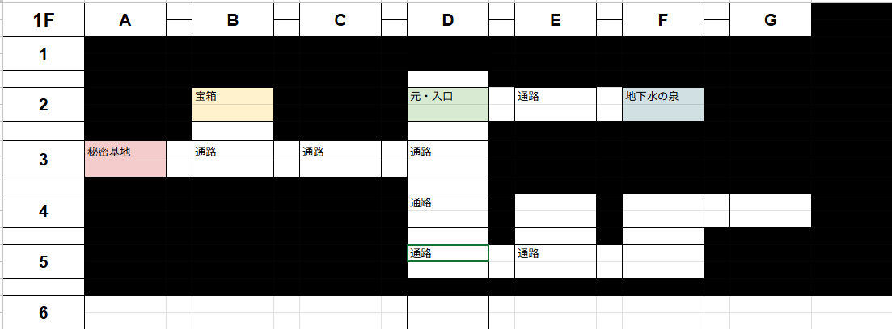
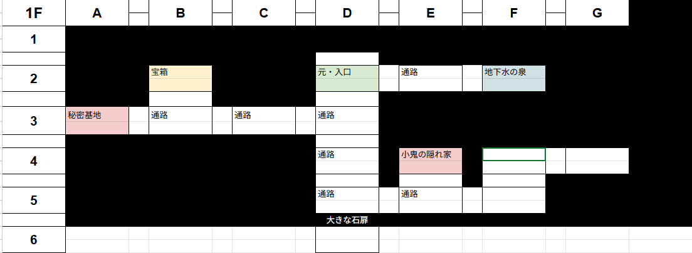

卓の基本情報は[こちら](./info.md)

# 七つの巡礼 第1回
## ◉ 導入
### ◆ キャトロ・リサ
- トココ村という、のどかだが活気のある村
  - 酪農で暮らしている
  - 村の老人は少し排他的だ
    - 行商人や巡回する騎士などにちょっと不寛容とのこと
- リサの友人のクレーがリサのところに遊びに来た
  - リサの父で村長のトーラスがリサが来たことを知らせてくれた
    - 会いに行くと、クレーはどうやら秘密の洞窟を見つけたとのこと
      - なにもないところに突然現れたらしい
      - 「秘密基地にしよう！　一緒に行こう」
      - 同行することに
      - キャトロはその様子をたまたま通りがかりに見ていたようだ
        - キャトロはこっそり後をつけることにしたようだ
  - クレーは冒険者を目指しているようだ
    - 魔法が少し使えるリサに魔法を教わりたいそうだ
    - そんな話をしながら山の方へと向かう
- そんなとき、別の場所で、村に人が来訪した
  - 村の老人はジロジロとみているようだ
  - 赤髪の女性の旅人は、村長に用があるらしい
    - 首都まで戻るには日が暮れちゃうから泊まる場所を探しているようだ
      - 村長曰く、排他的で宿はないそうだ。だが、村長宅に好意で泊めてもらうことに

### ◆ セドリック・アリス
- 女王の近衛騎士に志願した少し後、直接謁見にくるように、とのことで馳せ参じた
  - 一人でくるように、とのことだったので一人で来た
  - 近衛騎士になるには実績が必要とのこと
    - 北方のトココ村に急に洞窟が出来て良からぬものが這い出てきたとのこと
      - 下級の蛮族だろうとのこと
      - 人員はある程度用意しているが、必要に応じて調達せよ、とのこと
    - 王女は玉座から降りてきて、同じ高さに立った
      - 期待しているとのこと
        - 女王はセドリックに好意があるのかも……？　とのこと
    - ギュンター王国軍旅団長に声を掛けられる
      - 礼儀を褒められた
      - 人員の推薦があるとのこと
    - 旅団の兵舎に向かう
      - 背丈の小さい女の子がいる
        - アリスだ
          - 面識のある女の子だ
            - 王宮で何度も顔を合わせている
          - アビスボーンの生まれで、王宮では邪険に扱われているらしい
            - 実績を付けてあげたいそうだ
              - 了承することに
      - ギュンターはアリスに励ましの言葉をかけた
        - ギュンターは1日10分だけ通話ができる〈通話のピアス〉の亜種のようなものらしい
        - 火急の用の場合は連絡せよとのこと

### ◆ フュネラル
- 傭兵団は、1年前に大金を稼いだが、どうにも最近依頼がなく、なんとかその残金で細々と暮らしているらしい
- 団長のアイクに呼ばれた
  - アイクは傷も癒え
  - ただ、フュネラルは戦場を求めてアイクの元に来たはずだ
  - フュネラルが一人前になるころには戦場が落ち着いていて、腕を試す機会がなかっただろう、と
    - 依頼が来ているらしい
  - 貴族の三男坊の護衛の依頼だ
    - 単なる護衛にしては、どうにも依頼期間が長い
    - 依頼にはなにか裏があるのでは……？とのこと
      - もっと大きな目的があるのでは？
  - 参加してみないか？　と言われる
    - 参加することに
      - 王都に迎え、とのこと
- 何かアレば連絡するように、とのこと

### ◆ ネモ
- アースガルズ王国内、キルヒア大神殿のアルシーヴ司祭に呼ばれた
  - お願いがあるとのこと
    - ハルヴァートン家の三男坊の近衛試験があるとのこと
      - そこに神官を要請されたので、そこに向かって欲しいとのこと
      - 神官は祈るのみに非ず。実地での経験も必要だろう、と
        - 承知した
    - ネモが承知すると、特別な聖印を賜った
      - 特別に聖別し、加護を与えた聖印とのこと
        - 頂戴した

## ◉ トココ村
- 村長がソワソワしている
  - 赤髪の旅人が声を掛けると、門限を守る子なのに帰ってこないとのこと
- クレーの親が村長宅に駆け込んできた
  - クレーも帰ってきていないらしい
- 赤髪の旅人が助けを申し出るも、旅人さんは座っていてくれ、とのこと
  - 赤髪の旅人はリサが山の方に向かったことを村長に知らせる
  - 村長曰く、あちら側には蛮族が出てきたから討伐依頼をしたとのこと
  - そこにセドリック・アリス・フュネラル・ネモが到着した
  - 村長に事情を訊いて、すぐに洞窟に向かうことに
- そのとき、森の方から信号弾が上がる
  - 村長曰く、マギテック技能を持っているのはこの村ではキャトロのみだとのこと
  - 洞窟の方向とも一致しているため向かうことに
  - 村長から周辺の地図を貰った

## ◉ 洞窟へ
- 
- 洞窟の各部屋は、1部屋1分程度探索に時間がかかりそうだ
- リサたちは【A-3】にある「秘密基地」にいる
  - キャトロは周辺を確認している
- 洞窟が突然揺れる
  - 秘密基地の床が抜けてしまった！
  - リサは助かったが、クレーは落ちてしまった！
    - 10mくらい落下してしまったようだ
    - 意識はあるようだが、痛みで動けないようだ
    - 足が動かないようだ
      - リサは【ヒールスプレー】をクレーに撃った
        - 怪我はなんとかなったようだ
      - しかし、クレーは上がれないようだ
      - リサはロープなどは持っていない……
    - キャトロは冒険者セットを持っている
      - ロープが中にあった！
      - 2人を𠮟りながら救助することに
  - クレーを引き上げた！
    - 危機感知：**成功**
      - こちらを見つめる怪しい目が……
        - 小鬼どもだ！
        - 今にも襲いかからんとしている！
          - 後ろから騎士や魔法使いが助っ人として来た！
            - 騎士たちは小鬼たちを一刀両断で斬り捨てた！
- 危険感知：**成功**
  - 他にも小鬼たちがたくさん居たようだ……
    - 戦闘だ！

### ◆ 小鬼たちとの戦闘（1 戦目）
- 魔物知識：**成功**（弱点値まで）
  - 洞窟の小鬼 x 4
    > 洞窟の小鬼　HP/MP：19/--　知覚：五感（暗視）
    > 知能：低い　知名度：6/9　弱点：全ダメ+4　先制：9
    > 生命（精神）抵抗：10/10 回避：8　防護：1
    > ▼攻撃方法
    > ・棍棒　　命中11　ダメージ2d+3
    > ▼特殊能力
    > 〇闇より這出た者：種族上蛮族として扱われるが、蛮族を対象とする効果の影響を受けない
  - 洞窟の小鬼・弓装備 x 2
    > 洞窟の小鬼・弓装備　HP/MP：12/--　知覚：五感（暗視）
    > 知能：低い　知名度：6/11　弱点：全ダメ+4　先制：9
    > 生命（精神）抵抗：10/10 回避：--　防護：0
    > ▼攻撃方法
    > ・射撃　　命中10　ダメージ2d　敵後衛への攻撃の場合ダメージ-4（最低1）
    > ▼特殊能力
    > 〇ターゲッティング
    > 〇闇より這出た者：種族上蛮族として扱われるが、蛮族を対象とする効果の影響を受けない
    > 〇精密狙い：偶数ラウンド中、このキャラクターは「鷹の眼」を持つものとして扱う。
- 先制：**成功**
- 結果：**未定**
  - セドリックが小鬼1匹を一撃で屠る！
  - リサの槍が敵を屠る！

#### ▼ 戦利品
- 360 G
- 任意のAカード x 1

### ◆ 戦闘終了後
- 小鬼を討伐した後、すぐに黒い液体となって溶けてしまった……
  - 神官であるセドリックとネモは、一般的な蛮族とは全く違う生き物だと感じた
- 洞窟全体が揺れる！
  - どこかが崩れ、どこかが開いたような音を感じる
    - 洞窟の構造が変わってしまったかもしれない……
    - 非戦闘員もいるから急いで出よう！
      - 出ようとしたが、落石で出口が塞がっている……！
      - クレーは別の出口を知っているらしい
      - 奥側にもう一つ出入り口があるらしい
        - そちらを目指そう
          - バックアタックが怖いから、きちんと虱潰しにクリアリングしていこう

### ◆ 地下水の泉（F2）
- 
- 地下水の泉だ
  - 飲むとMPが回復する水のようだ！
- お互いに自己紹介をした！

### ◆ 宝箱の部屋（B2）
- 
- 宝箱がある！
  - 探索：**成功**
    - 毒針の罠がある！
      - 解除：**成功**
        - 罠が解除できた！
  - 〈任意の能力増強の指輪〉 x 1 を手に入れた！
    - ネモが所持することに！（知力）

### ◆ 奥へ向かう
- 
- 【D6】へ向かおうとすると、奥に向かう道に扉がある……
  - クレー曰く、ここに扉はなかったとのこと
- 扉を調べてみると、見たことのない言語で何かが書かれている
  - 少なくとも有名な言語ではないようだ
  - リサはこれと同じ文字を家の書籍か何かで見たことがあるような気がする……
- 探索：**成功**
  - この扉は力ずくでは動きそうにない
  - 扉には綺麗に何かがハマりそうな人工的な窪みがある
    - ここに何かをハメれば開くかも？
- ひとまず置いておいて、別の道を探してみよう

### ◆ 小鬼の隠れ家（E4）
- 
- 異常感知：**成功**
  - 足跡が異様に多いような……？
    - 何かが奥で動いている！
    - キャトロが【サウンド・ボム】を使って気を引いた！
      - 奇襲を仕掛けることが出来た！
        - 戦闘だ！

### ◆ 小鬼たちとの戦闘（2 戦目）
- 魔物知識：**成功**（弱点値まで）
  - 洞窟の小鬼 x 2（判明済／判定不要）
    > 洞窟の小鬼　HP/MP：19/--　知覚：五感（暗視）
    > 知能：低い　知名度：6/9　弱点：全ダメ+4　先制：9
    > 生命（精神）抵抗：10/10 回避：8　防護：1
    > ▼攻撃方法
    > ・棍棒　　命中11　ダメージ2d+3
    > ▼特殊能力
    > 〇闇より這出た者：種族上蛮族として扱われるが、蛮族を対象とする効果の影響を受けない
  - 洞窟の小鬼・弓装備 x 2（判明済／判定不要）
    > 洞窟の小鬼・弓装備　HP/MP：12/--　知覚：五感（暗視）
    > 知能：低い　知名度：6/11　弱点：全ダメ+4　先制：9
    > 生命（精神）抵抗：10/10 回避：--　防護：0
    > ▼攻撃方法
    > ・射撃　　命中10　ダメージ2d　敵後衛への攻撃の場合ダメージ-4（最低1）
    > ▼特殊能力
    > 〇ターゲッティング
    > 〇闇より這出た者：種族上蛮族として扱われるが、蛮族を対象とする効果の影響を受けない
    > 〇精密狙い：偶数ラウンド中、このキャラクターは「鷹の眼」を持つものとして扱う。
  - 吸血コウモリ x 2
    > 吸血コウモリ　HP/MP：9/--　知覚：五感（暗視）
    > 知能：低い　知名度：5/8　弱点：攻撃命中時、即死　先制：10
    > 生命（精神）抵抗：8/8 回避：9　防護：0
    > ▼攻撃方法
    > ・小さな牙　　命中11　ダメージ1d+1
    > ▼特殊能力
    > 小さな狩猟者：このキャラクターは通常戦闘ルール、および乱戦ルールを無視して移動できる
    > ※乱戦内にいる場合も自由に移動でき、敵後方エリアへ侵入することができる。
  - 洞窟の小鬼・首領 x 1
    > 洞窟の小鬼・首領　HP/MP：40/--　知覚：五感（暗視）
    > 知能：人間並み　知名度：6/10　弱点：魔法ダメ+4　先制：11
    > 生命（精神）抵抗：4+/3+ 回避：4+　防護：3
    > ▼攻撃方法
    > ・棍棒　　命中5+　ダメージ2d+6
    > ・頭蓋砕き　命中3+　ダメージ1d+2 確定ダメージを与える
    > ▼特殊能力
    > 〇高速戦闘術：「棍棒」と「頭蓋砕き」を１回ずつ使用
    > 〇闇より這出た者：種族上蛮族として扱われるが、蛮族を対象とする効果の影響を受けない
    > 〇群れの統率者：自身がいる限り、「洞窟の小鬼」と名の付くすべては知能：人間並みとして扱う。味方の「精密狙い」はラウンド数に関係なく常に発動するようになる。
- 先制：**成功**
- 結果：**未定**
  - アリスの攻撃がクリティカル！　1回転だ！
  - リサの【アクス＝マリスティアス】で首領が吹っ飛ぶ！
